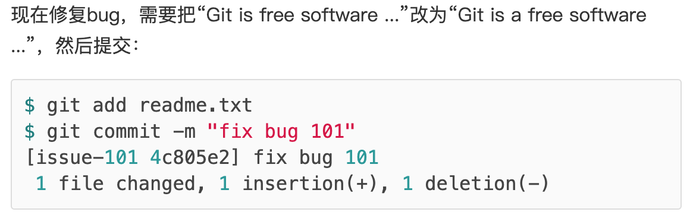

git是用C语言编写的，是一个分布式版本控制系统。

集中式版本控制系统，版本库是集中存放在中央服务器的。先从中央服务器获取最新的版本，修改之后，再将文件提交到中央服务器


分布式版本控制系统，每台电脑上都有一个完整的版本库。有一个中央服务器，方便交换文件


# 创建版本库

在合适的地方创建一个目录，并且使用`git init`可以将该目录变成git可以管理的仓库。该目录下会多出一个`.git`目录，该目录是Git跟踪管理版本库的

**注意：版本控制系统只能跟踪文本文件的改动，对于图片、视频、以及word文件这种二进制文件，没办法跟踪**

除了`git init`，其他的git命令需要再git仓库目录内执行

将文件放在git仓库的步骤：

- git add readme.txt                                                添加文件
- git commit -m "这里写本次提交的说明说明"      将文件提交到仓库

可以调用add多次，调用commit一次，就可以提交多个文件

# 版本控制

`git log`可以显示从近到远的提交日志，


954……是commit id（版本号），是使用SHA1计算出来的一个十六进制数字

`git reset --hard 954b` 可以将版本回退到指定的版本（只用写版本号的前几位，git可以自动寻找）

git版本回退的速度很快，因为git内部有一个指向当前版本的`HEAD`指针，回退的时候，只是改变指针。

**git log与git reflog：**

- `git log`可以显示所有提交过的版本信息，不包括已经被删除的commit记录和 reset 的操作

- `git reflog`是显示所有的操作记录，包括提交，回退的操作。

## 工作区和暂存区

工作区：电脑中可以看到的目录

版本库（Repository）


`.git`是一个隐藏在工作区中的版本库，其中`stage`(或者叫index)是暂存区，以及git自动创建的分支`master`，以及指向`master`的指针`HEAD`

将文件添加到git版本库，分为两步：

- git add，实际上将文件修改暂时添加到**暂存区**
- git commit，提交修改，将暂存区的所有内容提交到当前分支（创建git版本库的时候，git自动创建了一个`master`分支，或者叫`版本库`） 

`git add -all`：可以将工作区中的所有文件添加到暂存区

`git status`：Untracked files，这些文件还没有add过


## 管理修改

git跟踪的是**文件的修改**，而不是文件

如果修改文件之后，没有使用`git add`，使用`git commit`的时候，本次修改就不会被提交，只会提交暂存区中的修改。

`git dif HEAD -- readme.txt`：查看工作区和版本库中的最新版本的区别。

## 撤销修改

`git checkout -- readme.txt`：将readme.txt文件在**工作区**中的修改全部撤销

- 修改后还没有放在暂存区（没有git add），撤销到版本库状态
- 添加到暂存区之后，又修改了，撤销到添加暂存区的状态

`git reset HEAD <file>`：可以将**暂存区**中的修改撤销掉，重新放回工作区

如果修改已经提交到了版本库中，可以使用**版本回退**命令`git reset --hard 954b`，前提是文件还没有推送到远程库。

## 删除文件

直接删除了工作区的文件后（rm readme.txt），工作区和版本库就会不一致，两个选择：

- 删除版本库中对应的文件，`git rm readme.txt`
- 恢复工作区中该文件到版本库中的最新版本，`git checkout -- readme.txt`

# 远程仓库

在用户主目录里找到`.ssh`目录，里面有`id_rsa`和`id_rsa.pub`两个文件，这两个就是SSH Key的秘钥对，`id_rsa`是私钥，不能泄露出去，`id_rsa.pub`是公钥，可以放心地告诉任何人。

为什么GitHub需要SSH Key呢？GitHub使用公钥来识别出推送的提交是本人推送的。

GitHub允许添加多个Key。假定有若干电脑，只要把每台电脑的Key都添加到GitHub，就可以在每台电脑上往GitHub推送了。

## 添加远程库

```
git remote add origin git@github.com:michaelliao/learngit.git    关联远程库
git push -u origin master      将本地当前分支master推送到远程
```

origin为远程库的名字，michaelliao为github账户名，

`-u`：git不但会将本地的master分支内容推送到远程新的master分支，而且会将本地的master分支和远程的master分支关联起来

在以后，只要本地提交了，可以使用：`git push origin master`将本地的master分支推送到Github

## 删除远程库

`git remote rm <name>`：”删除“除远程库，实际上只是解除了本地和远程的绑定关系，需要登录github才可以真正删除

`git remote -v`：查看远程库信息

## 从远程库克隆到本地库

```
git clone git@github.com:michaelliao/gitskills.git
```

git支持多种协议，git://使用ssh协议，还可以使用https等其他协议

# 分支管理

定义：分支是用来开发新功能、修复bug或者进行任何项目工作的可移动指针。它们允许你在不影响主要项目或代码的情况下进行并行开发或实验性工作。

特点：独立性，并发开发，合并和比较

HEAD指向当前分支master，master分支指向提交


创建dev分支


HEAD指向当前分支dev，当前对工作区的修改和提交就是针对dev分支


dev上的工作完成后，将dev分支合并到master，只需要将master指向dev当前提交就可以了：


合并完后，可以删除dev分支

**创建dev分支：**

- git checkout -b dev     加上-b表示创建分支并且切换到当前分支
- 两步
  - git branch dev     创建dev分支           
  - git checkout dev  切换到dev分支（将HEAD指向dev）

为了避免和撤销操作混淆，可以使用`switch`来替代这里的checkout（不过应该使用-c，而不是-b）

`git branch`：查看所有分支，*表示当前分支


**合并分支**：

`git merge dev`：将dev分支合并到当前分支上

**删除分支**：

`git branch -d dev`


删除dev分支的时候，不能在dev分支下，应该先切换到其他

`git log --graph`：可以看到合并分支图

## 分支管理策略

合并分支是，git默认使用fast-forward策略，这种模式下，删除分支后，会丢失分支信息

使用参数`--no-ff`可以禁用fast-forward

## Bug分支

**需求**：假设当前dev上的工作还没有做完，还没办法提交，但是此时有一个bug需要紧急修复，该怎么办？

使用`git stash`可以将工作区保存起来，后续可以恢复现场继续工作。

假设当前需要在master分支上修复bug，就需要从master创建临时分支：

- `git switch master`    切换到master分支

- `git switch -c issue-101`     创建并且切换到issue-101分支

- 在issue-101上修复Bug，并且使用add与commit



修复完Bug后，切换到master分支，并完成合并，删除issue-101分支：

- git switch master
- git merge --no-ff -m "merge bug fix 101" issue-101

`git stash list`：可以查看刚刚保存的工作区的内容


`git stash apply`：恢复工作区，但是不删除stash内容

`git stash drop`：删除stash内容

`git stash pop`：恢复工作区并且删除stash内容

`git stash apply stash@{0}`：多次stash后，可以先采用`git stash list`查看，然后恢复指定的stash

dev分支是从master分支分出来的，bug也是一样的，现在修复dev中的bug(issue-101)：

- `git switch dev`
- `git cherry-pick 4c805e2`        将4c805e2这个提交做的修改复制到dev分支上

## Feature分支

添加新功能的时候，不要直接在主分支上开发，最好创建一个feature分支，开发完成后，合并该分支，并删除该分支。

当创建一个新的分支的时候，该分支添加了新内容（执行过add和commit），如果没有合并，此时删除该分支就会出错，需要使用-D参数。


## 多人协作

`git remote`或者`git remote -v`可以显示远程库的信息，

**推送分支：**

`git push origin master`

**多人协作的流程：**

1. 使用`git push origin <branch-name>`推送自己的更改
2. 如果推送失败 ，因为远程分支比本地分支新，使用`git pull`