# 简介

## 并行简史

早起的计算机中没有操作系统，只能串行执行程序。

操作系统的出现使得计算机可以每次运行多个程序，不同的程序可以在单独的进程中运行，操作系统为每个独立的进程分配各种资源。

加入操作系统来实现多个程序同时执行的原因：

- 资源利用率。例如：某些程序必须等待外部操作完成（比如输入输出），在该程序等待的同时运行另外一个程序，将提高资源的利用率
- 公平性。通过时间分片使得多个程序或者多个用户可以共享计算机资源
- 便捷性。编写多个程序，并且在必要的时候相互通信，比只编写一个程序完成所有计算任务容易实现。

线程允许在同一个进程中同时存在多个程序控制流。线程会共享进程范围内的资源，但是每个线程拥有各自的程序计数器（PC）、栈、局部变量等

## 线程的优势

- 发挥多处理器的强大能力：

  - 基本的调度单位是线程，一个线程只能同时在一个处理器上运行，多线程程序可以同时在多个处理器上执行，提高了处理器资源的利用率，进而提高了系统吞吐率。

  - 多线程在单处理器上也可以获得更高的吞吐率。当一个线程在等待某个I/O操作的时候，可以继续运行另外一个进程。使得程序可以在I/O阻塞期间继续运行。

- 建模简单：通过使用线程，可以将复杂并且异步的工作流进一步分解为一组简单并且同步的工作流，每个工作流在一个单独的线程中运行，并在特定的同步位置进行交互。

- 异步事件的简化处理

- 响应更灵敏的用户界面

## 线程带来的风险

- 安全性问题

例子：

```JAVA
@NotThreadSafe
public class UnsafeSequence{
		private int value value;
		public int getNext(){
				return value++;		
		}		
}
// 上述方法是线程不安全的，两个线程在调用getNext时可能会得到相同的值
```

由于多个线程要共享相同的内存地址空间，而且是并发运行的，他们可能会访问或修改其他线程正在使用的变量。

下面将getNext修改为一个同步方法：

```java
@ThreadSafe
public class Sequence{
		@GuardBy("this") private int value;
		public synchronized int getNext(){
				return value++
		}
}
```

- 活跃性问题

当某个操作无法继续下去执行的时候，就会发生活跃性问题。比如：线程A在等待线程B释放其持有的资源，但是B永远不释放资源，A就会一直等待下去。

- 性能问题

在多线程中，当线程调度器临时挂起活跃线程并转而执行另外一个线程时，就会频繁出现上下文切换操作，这种操作带来极大的开销（保存和恢复上下文）


线程无处不在

# 基础知识-线程安全性

对象的状态是指存储在状态变量 (例如实例或静态域)中的数据，对象的状态可能包括其他依赖对象的域。

“共享” 意味着变量可以由多个线程同时访问，而“可变” 则意味着变量的值在其生命周期内可以发生变化
一个对象是否需要是线程安全的，取决于它是否被多个线程访问。可以采用同步机制来使得对象是线程安全的。

java中的同步机制主要是关键字==synchronized==，它提功了一种加锁方式，"同步"还包含==volatile==类型的变量，==显示锁==以及==原子变量==。

多个线程访问一个可变的状态变量时没有使用合适的同步可能出现错误，补救办法：

- 不在线程之间共享该状态变量
- 将状态变量修改为不可变的变量
- 在访问状态变量的时候使用同步

程序状态的封装性越好，就越容易实现程序的线程安全性。

## 什么是线程安全性

定义：当多个线程访问某个类时，这个类始终可以表现出正确的行为，那么该类就是线程安全的。

**无状态对象一定是线程安全的**

无状态对象：只有方法、没有数据域（可以有不可变数据成员，比如String对象），而且不包含任何对其他类中域的引用

## 原子性


++count涉及到三个独立的操作：读取count的值，将值加1，将结果写入count。

问题：两个线程可能同时读取到count，并且将count的值都设置为count+1

这种由于不恰当的执行时序而出现的不正确的结果叫做==竞态条件==，当某个计算的正确性取决于多个线程的交替执行时，就会发生竞态条件。

### 竞态条件（race condition）

最常见的竞态条件类型：先检查后执行，可能通过一个失效的观测结果来决定下一步的动作。

### 延迟初始化中的竞态条件

延迟初始化的目的是将对象的初始化操作推迟到实际被使用时才进行，同时确保只被初始化一次。

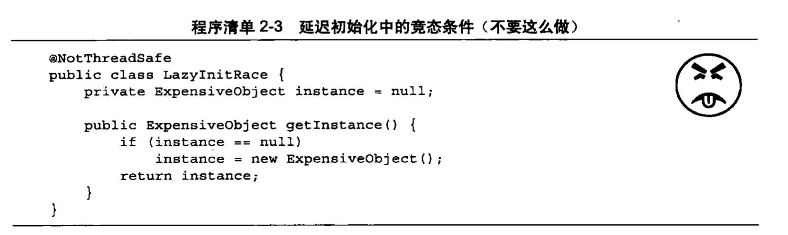

假定线程A和线程B同时执行getInstance，A和B都判断instance为null，就会分别创建ExpensiveObject实例，两次调用getInstance中就会得到不同的结果（这和预期不一样）。

### 复合操作

为保证线程安全性，“先检查后执行”（例如延迟初始化）和“读取-修改-写入”（如++count）等==复合操作==必须是原子的。

复合操作：包含了一组必须以原子方式执行的操作以确保线程安全性

java中可以使用==加锁机制==，来保证原子性。

java.util.concurrent.atomic中包含一些原子变量类，用于实现在数值和对象引用上的原子状态转换。

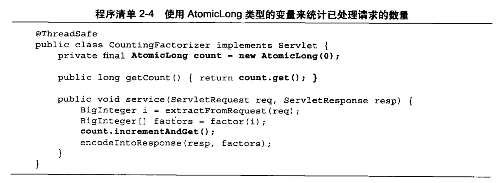

使用AtomicLong来代替long类型的计数器，可以确保所有对计数器状态的访问操作都是原子的。

**注意**：

- 在一个无状态的类中添加一个状态时，如果该状态完全由线程安全的对象来管理，那么这个类依旧是线程安全的。

- 在实际的情况中，尽可能的使用线程安全对象（比如AtomicLong）来管理类的状态

## 加锁机制

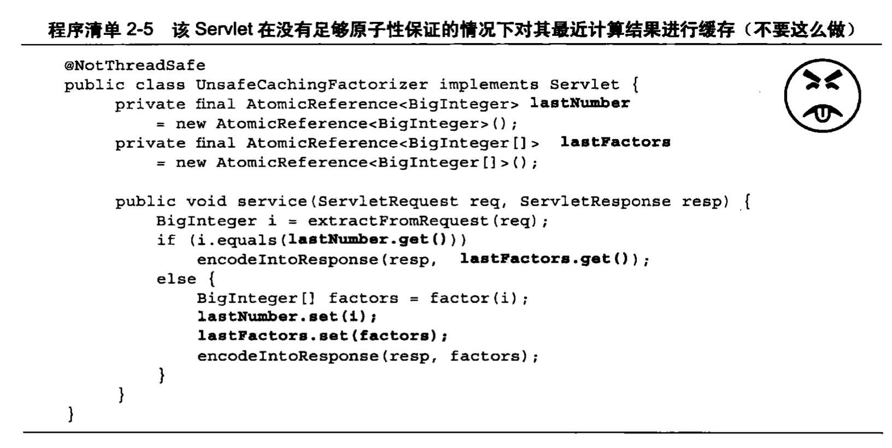

尽管lastNumber和lastFactors都使用了线程安全的对象，两次调用set都是原子的，但是无法同时set。比如在线程A获取到这两个值的过程中，线程B可能修改了他们。

**要保持状态的一致性，需要在单个原子操作中更新==所有相关==的状态变量**

### 内置锁

```java
synchronized(lock){
		// 访问或修改由锁保护的共享状态
}
```


**同步代码块**：java中用来支持原子性的内置锁机制。

内置锁：互斥体，最多一个线程可以拥有。所以最多只有一个线程执行内置锁保护的代码块，确保该代码块以原子的方式运行。

同步代码块的两个部分：

- 锁对象的引用
- 锁保护的代码块

关键字：synchronized

以sychronzied来修饰的方法就是一种横跨整个方法体的同步代码块，其中该同步代码块的锁就是方法调用所在的对象。

每个Java对象都可以看做一个实现同步的锁（称为内置锁或者监视锁）

线程在进入同步代码块之前获得锁（获得内置锁的唯一途径），在退出时自动释放锁。

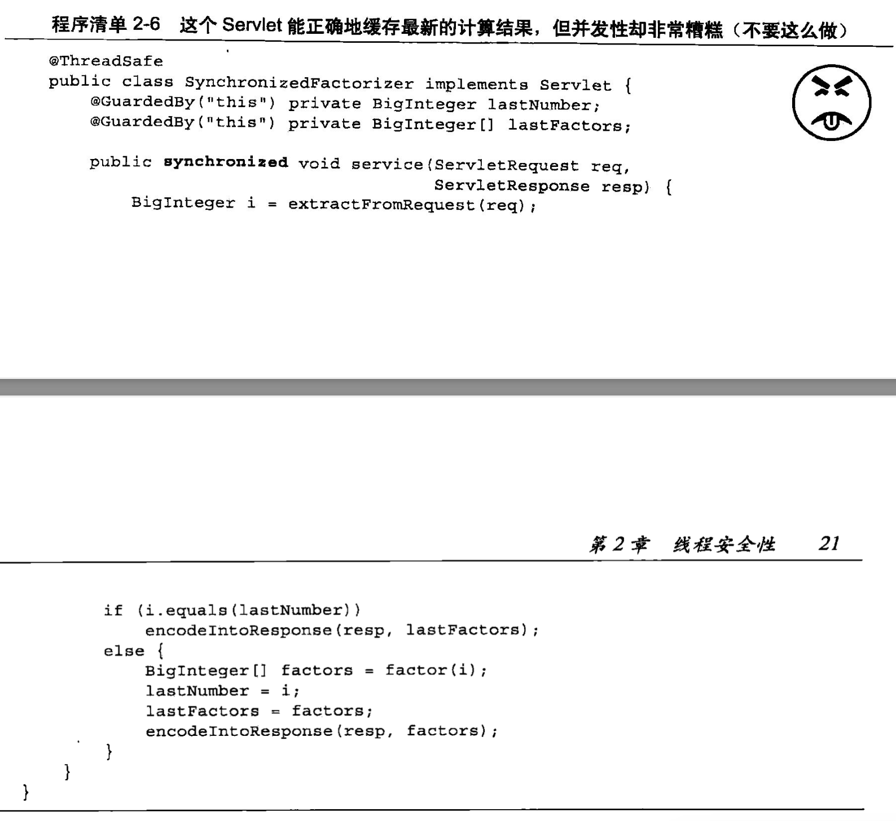

上述的方法没有线程安全问题，但是多个客户端无法同时使用，并发性很差。

### 重入

一个线程已经获得了某个对象的锁，那么它可以再次获得该对象的锁而不会被阻塞，因为它已经持有了这个锁。

重入的一种实现方法：

- 为每个锁关联一个计数值和一个所有者线程。计数值为0时，这个锁没有被任何线程持有。当一个线程请求一个计数值为0的锁时，JVM将记录该锁的持有者，并将计数值改为1。当同一个线程再次获取该锁，计数值递增。当线程退出同步代码块时，计数值递减。当计数值为0时，锁将被释放。

重入：提升了加锁行为的封装性，简化了面向对象并发代码的开发。

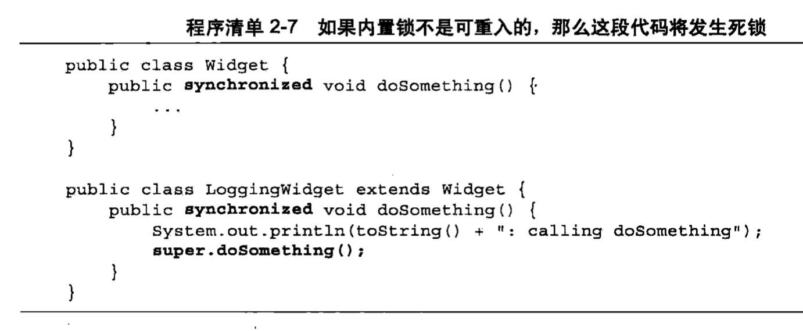

每个doSomething方法在执行之前都会获得Widget上的锁，如果内置锁不支持重入，在调用super.doSomething时将无法获得Widget上的锁。

## 用锁来保护状态

如果用同步来协调对某个变量的访问，在访问变量的所有位置都要使用同一个锁。

当获取与对象关联的锁时，并不能阻止其他线程访向该对象，只能限制访问同步方法或者同步代码块。

每个共享的和可变的变量都应该只由一个锁来保护。

一种常见的加锁约定：将所有的可变状态都封装在对象内部，并通过对象的内置锁对所有访问可变状态的代码路径进行同步，使得该对象不会发生同步访问。。这种方式不好，如果在添加新方法或代码路径时忘记使用同步，这种加锁协议将会被破坏。

只有被多个线程同时访问的可变数据才需要通过锁来保护。

如果只是将类中的每个方法都作为同步方法，并不足以确保复合操作也是原子的。

例如：

```java
if(!vebtor.contains(element)){
		vector.add(element);
}
// Vector中的contains方法和add方法都是原子方法，但是上面的代码不是原子的
```

将每个方法都作为同步方法还可能造成==活跃性问题==和==性能问题==。

## 活跃性与性能

程序清单2-6中对整个service方法进行同步，每次只有一个线程可以执行，即使系统中有多个CPU，请求也只能一个一个的处理。这种程序称为==不良并发应用程序==：可同时调用的数量，不仅受到可用处理资源的限制，还受到应用程序本身结构限制。

**可以缩小同步代码块的作用范围（将不影响共享状态且执行时间较长的操作从同步代码块中分离出去）**，来确保程序的并发性，又保证线程安全性。

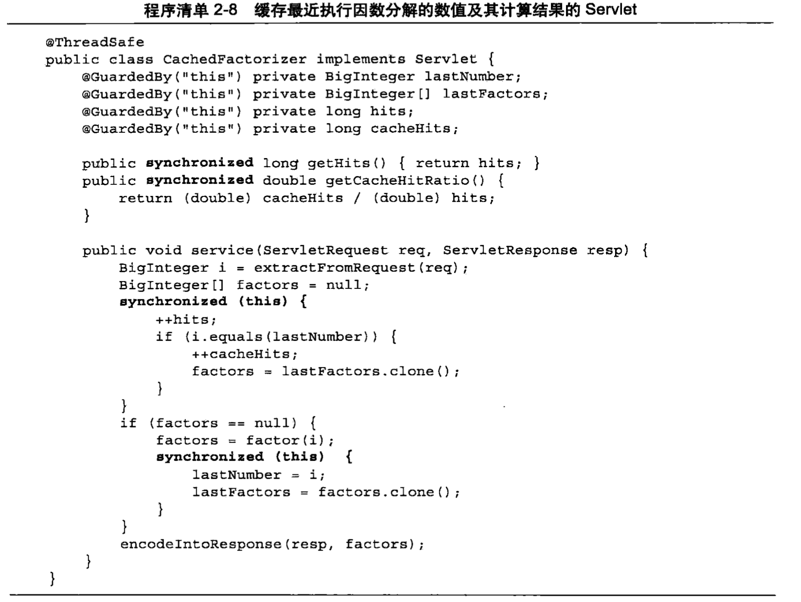

位于同步代码块之外的代码将以独占的方式访问局部（位于栈上的）变量，这些变量不会在多个线程之间共享，不需要同步。

这里已经使用了同步代码块，所以就不需要使用AtomicLong类型声明hits变量。

上面的Cachedfactorizer实现了简单性（对整个方法同步）和并发性（尽可能短的代码路径同步）之间的平衡。

==当执行时间较长的操作的时候，盲目持有锁可能会带来活跃性或者性能问题==

# 对象的共享

## 可见性

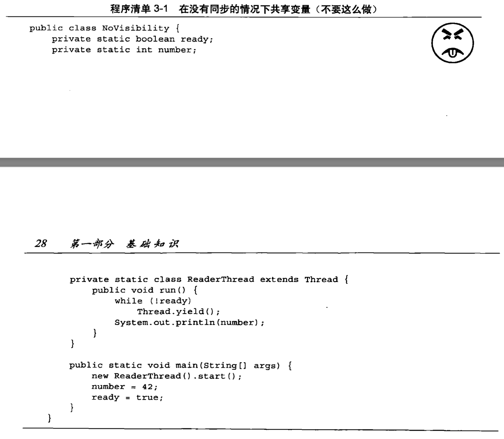

代码中没有足够的同步机制，无法保证主线程写入的ready值和number值对于读线程是可见的。

NoVisibility可能持续循环下去（看不到ready的改变），或者打印0（看到了写入的ready，但是看不到number的写入）。这种现象叫==重排序==。

在没有同步的情况下，编译器、处理器都可能对操作的执行顺序进行意想不到的调整。

### 失效数据

3-1中的读线程就可能看到失效数据，而且可能一个有效数据，另一个为失效数据。

导致失效数据的常见情况：一个线程调用了set，另外一个线程调用get可能得到set之后的值，也可能得到一个失效数据。

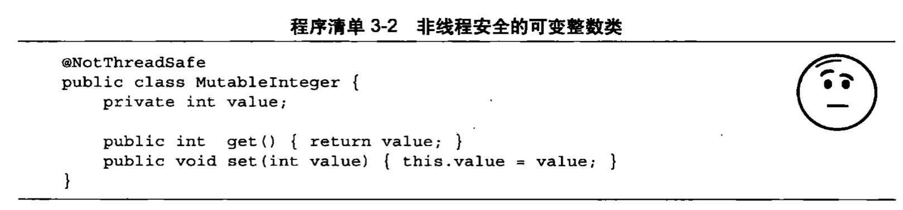

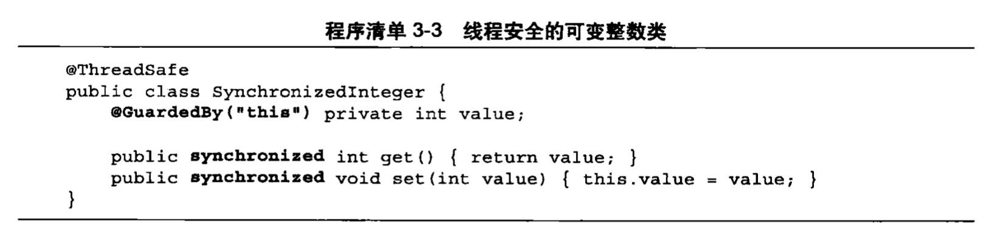

get同步操作的目的：防止调用get的线程得到失效数据

### 非原子的64位操作

最低安全性：当线程在没有同步的情况下读取变量时，可能得到一个失效值，但至少该值是之前某个线程设置的值。

对于==非volatile类型的long和double变量==（不满足最低安全性），JVM允许将64位的读操作或写操作分为两个32位的操作。当读取一个非volatile类型的long变量时，如果对该变量的读操作和写操作在不同的线程中执行，那么很可能会读取到某个值的高32位和另一个值的低32位。即使不考虑失效数据问题，在多线程程序中使用共享可变的long和double等类型的变量也是不安全的，除非用关键字volatile来声明它们，或者用锁保护起来

### 加锁和可见性

加锁的含义不仅仅局限于==互斥行为==，还包括==内存可见性==。**为了确保所有线桯都能看到共享变量的最新值**，所有执行读操作或者写操作的线程都必须在**同一个锁**上同步

### Volatile变量

比synchronized关键字更加轻量级的同步机制。

作用：用于确保变量的更新操作通知到其他线程。

==加锁可以保证可见性和原子性，而Volatile变量只能保证可见性==

可以将Volatile变量的读操作和写操作行为理解为程序3-3中的get和set方法，但是访问Volatile变量时不会执行加锁操作，不会使得执行线程阻塞。

例子：

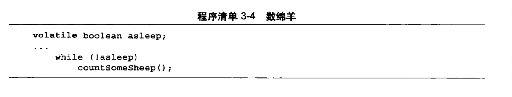

如果在验证正确性的时候需要对可见性进行复杂的判断，就不要使用Volatile变量，使用Volatile比使用锁的代码更加脆弱，更加难以理解。

Volatile使用的正确方式：

- 确保自身状态的可见性
- 确保引用的对象状态的可见性
- 标识重要程序生命周期事件的发生（操作完成、中断、状态的标志，比如上面的asleep）

使用Volatile的条件：

- 对变量的写入操作不依赖变量的当前值，或者保证只有单个线程更新变量的值
- 该变量不会与其他状态变量一起加入不变形条件
- 访问变量时不需要加锁

## 发布和逸出

**==发布==**：使对象能在当前作用域之外的代码中使用

发布的一种简单的实现方式：将对象的引用保存到一个公用的静态变量中，以便任何类和线程都能看到该对象。

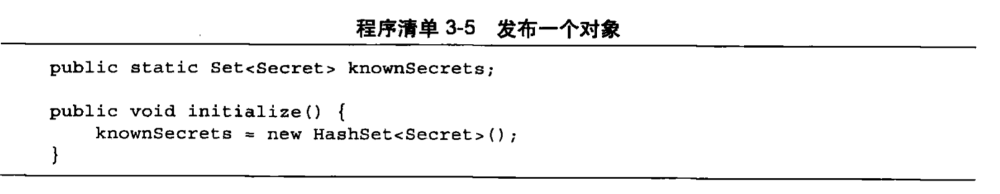

如果将对象添加到knowSecrets中，那么这个新对象也被发布了。

一般来说，如果一个已经发布的对象能通过非私有的变量引用和方法调用到达其他的对象，那么这些对象也会被发布。

**==逸出==**：当某个不应该发布的对象被发布

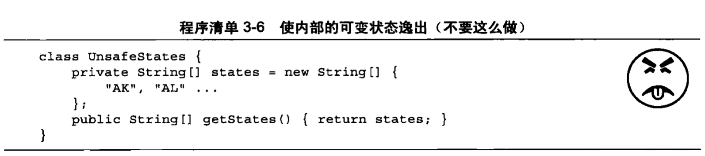


**安全的对象构造**

只有构造完成的时候this才可以逸出，下面的例子中，this在构造过程中逸出了。

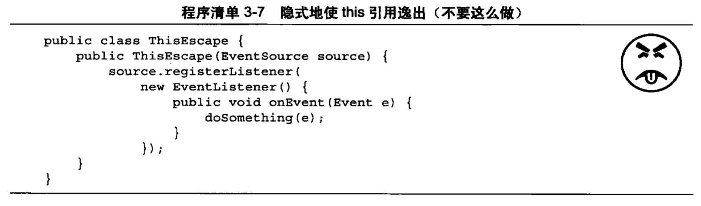

当ThisEscape发布EventListener时，也隐含发布了ThisEscape实例本身（内部类的实例中包含了对ThisEscape实例的隐含引用）。

可能导致this在构造过程中逸出的情况：

- 在构造函数中==启动==一个线程。因为this引用会被新创建的线程共享，新创建的线程可以看见还未完全构造完成的对象。（不是不能在构造函数中创建线程，只是不要立即启动，使用start或initialize方法启动）

- 构造函数中调用一个可改写的实例方法（不是私有方法、终结方法）

使用私有的构造函数和一个公有的工厂方法来避免不正确的构造过程：

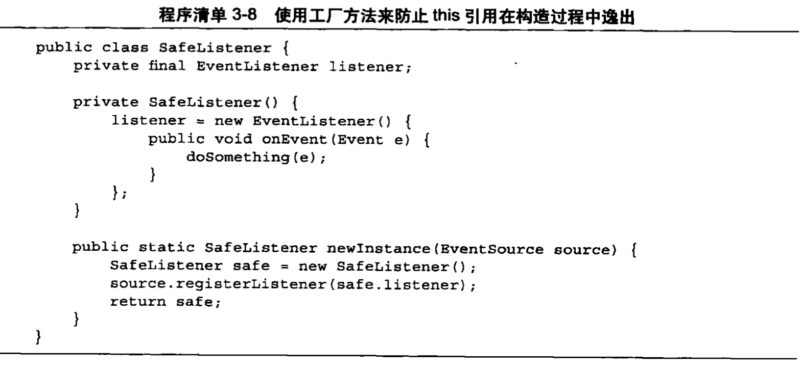

## 线程封闭

访问共享的可变数据时，实现线程安全性的方式：

- 同步
- 线程封闭（将一个对象封闭在一个线程中，将自动实现线程安全性）

### Ad-hoc线程封闭

含义：维护线程封闭性的职责完全由程序员来承担

Ad-hoc线程封闭很脆弱，在程序中尽量少使用

### 栈封闭

线程封闭的一种特例，在栈封闭中，只能通过局部变量才能访问对象。

局部变量被封闭在执行线程的栈中，其他线程无法访问该栈。

栈封闭比Ad-hoc线程封闭更加容易维护，更健壮

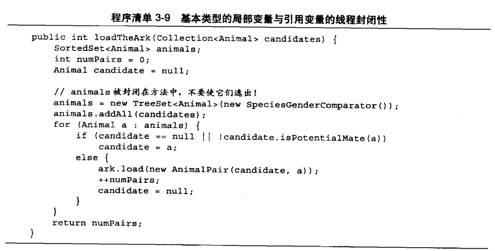

任何方法都无法获得基本类型的引用，该方法中的局部变量numPairs就不会破坏栈的封闭性。在java中基本类型的局部变量始终封闭在线程内。

集合animals的引用也被封闭在局部变量（执行线程栈）中，只要不将animals引用发布（或者集合对象中的数据），封闭性就不会被破坏。

### ThreadLocal类

维持线程封闭性更规范的做法，该类可以使线程中的某个值和保存值的对象关联起来。

通常用于防止对可变的单线程实例变量或全局变量进行共享。

`ThreadLocal` 可以为每个线程创建一个==独立的变量副本==，这样每个线程都可以访问和修改自己的副本，互不影响，从而避免了多线程共享变量的安全性问题。ThreadLocal提供了get和set的方法，get方法总是可以返回**当前线程**调用set设置的最新值。

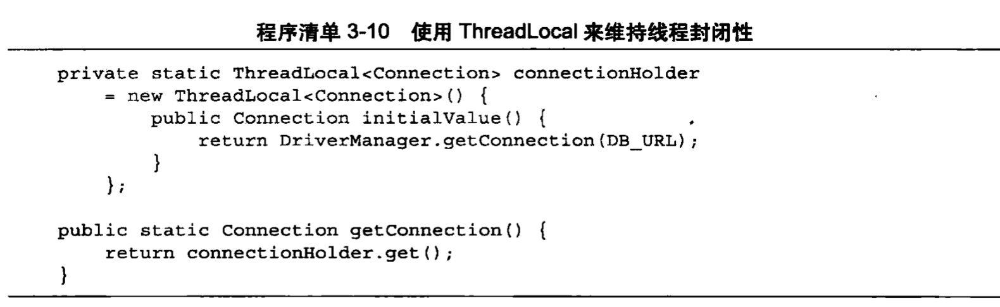

将JDBC连接保存到ThreadLoacl对象中，每个线程都会拥有自己的连接

## 不变性

不可变对象：某个对象早创建后就不能被修改

==不可变对象一定是线程安全的==

不可变对象并不代表着对象中所有的域都声明为final类型，即使对象中所有的域都是final类型的，这个对象依然是可变的，因为final类型的域可以保存可变可变对象的引用。

不可变对象的充分条件：

- 对象创阿后状态不能修改
- 对象的所有域是final类型
- 在创建对象期间，this引用没有逸出

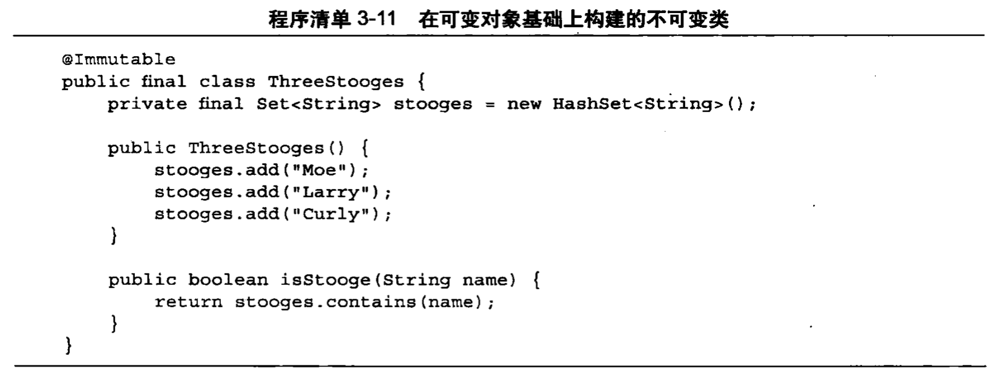

注意：

- 如果某个域是不可变的，应该将其声明为final域

- 使用Volatile类型来发布不可变对象

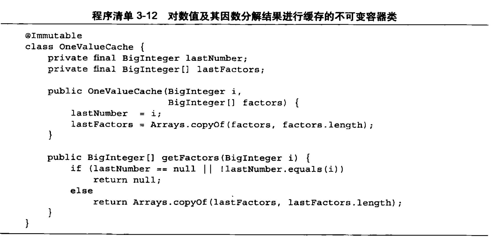

如果在OneValueCache和构造函数中没有调用copyOf，那么OneValueCache就不是不可变的。直接返回引用，外部可以通过引用来改变引用所指的对象 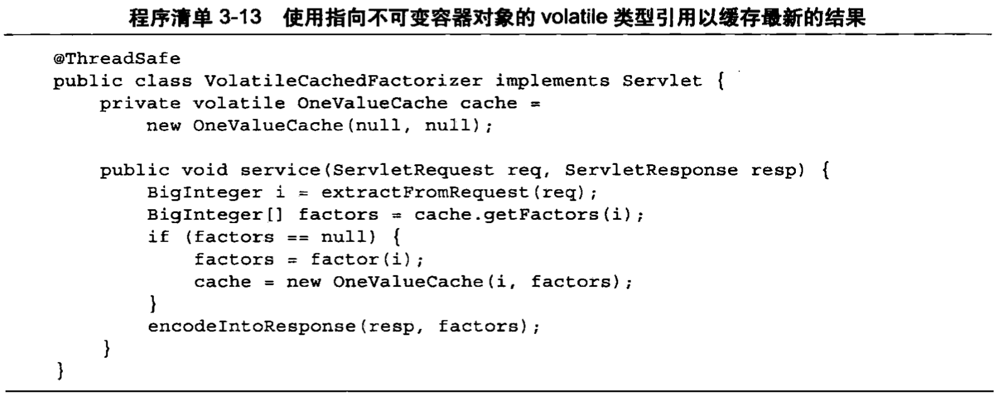

上面的类是线程安全的。

## 安全发布

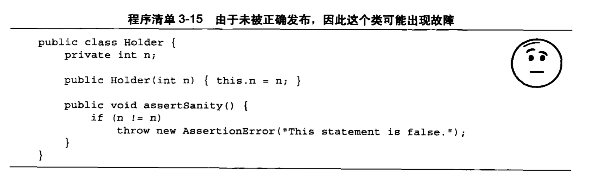

这种不正确的发布导致其他线程看到尚未创建完成的对象。

两个可能问题：

- 除了发布对象的线程外，其他线程可以看到的Holder域是一个失效值，因此将看到一个空引用或者之前的旧值

- 线程看到Holder引用的值是最新的，但Holder状态的值却是失效的

- 甚至抛出AssertionError异常，某个线程在第一次读取的时候得到一个失效值，第二次得到一个更新值
