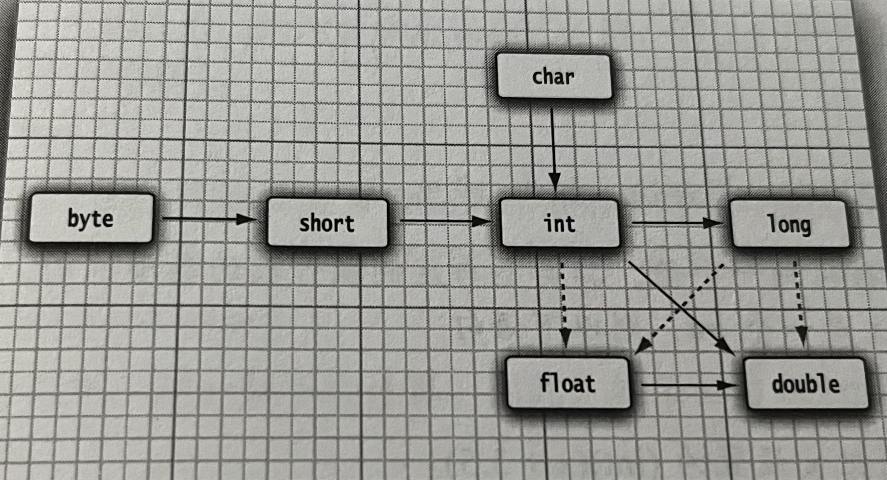
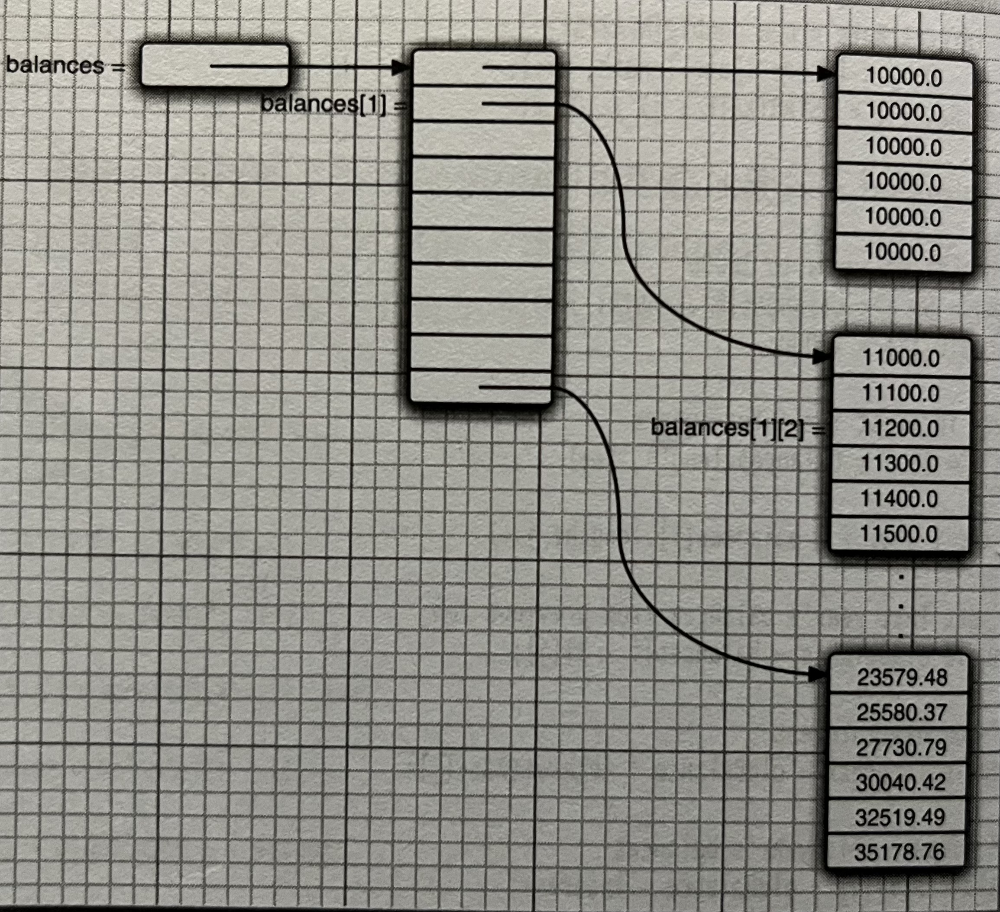
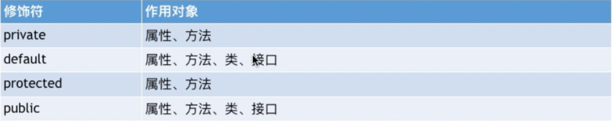
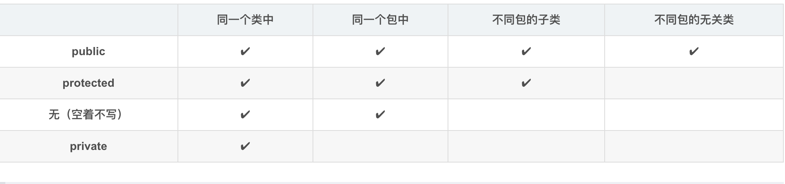
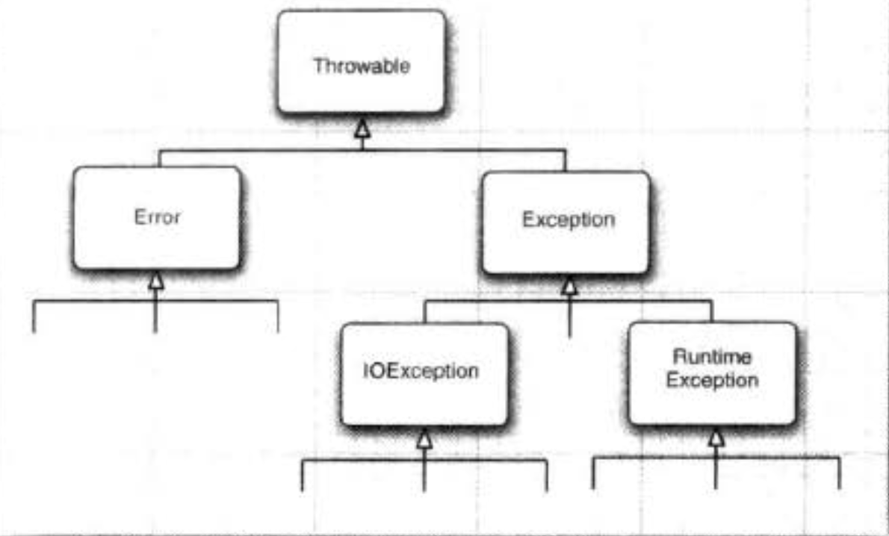
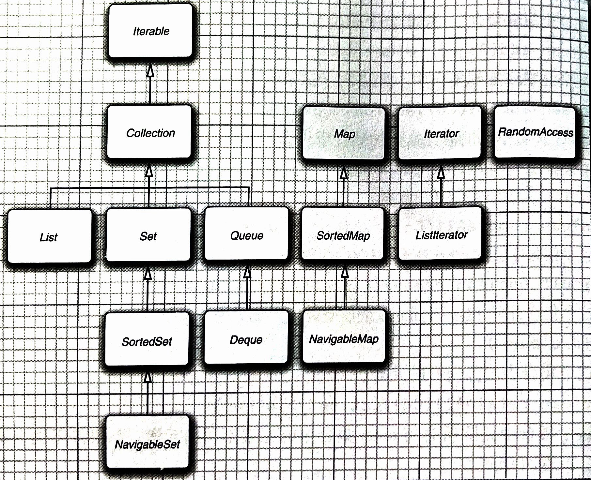
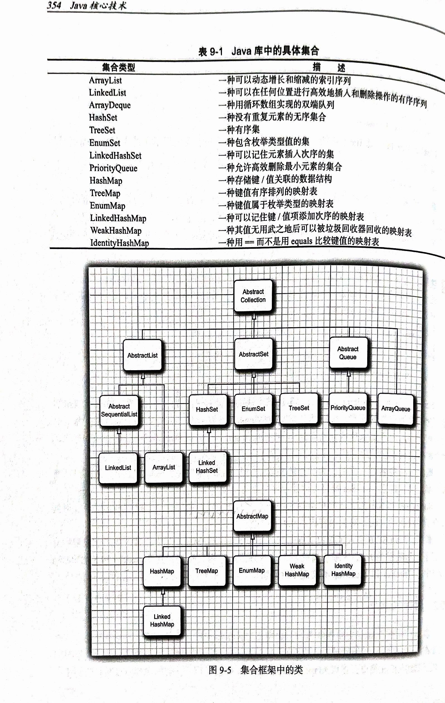
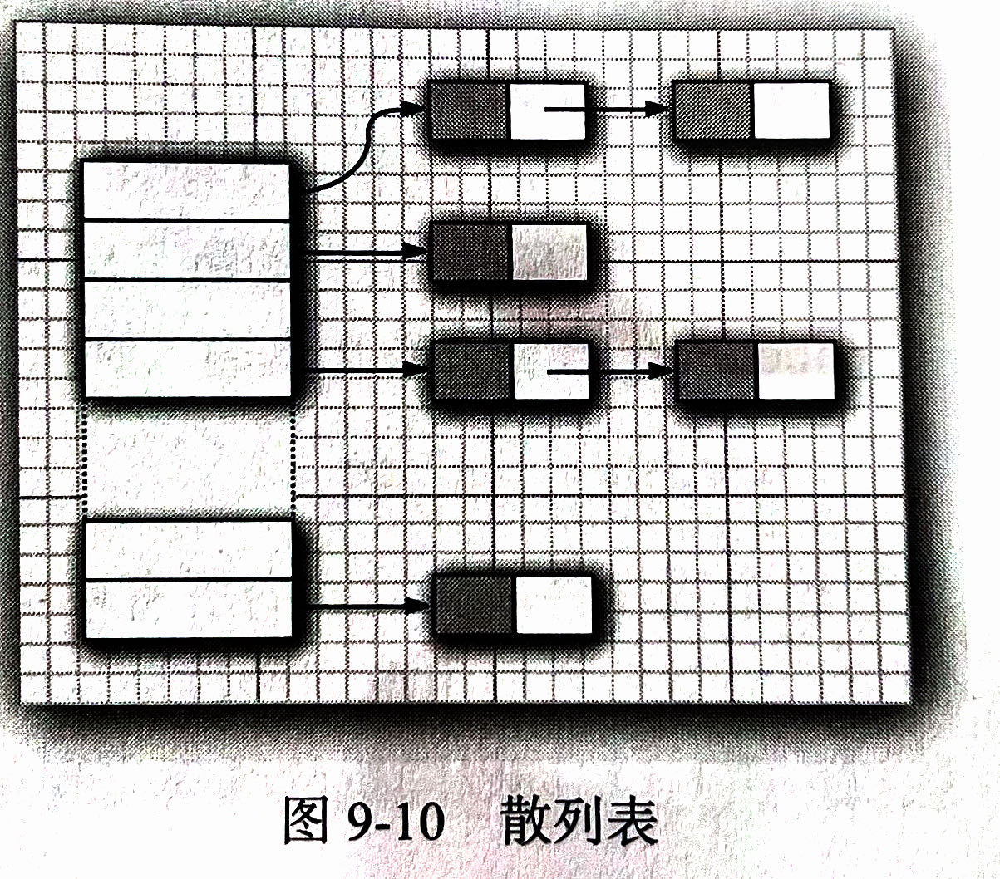

# java基本程序设计结构

java区分大小写

源代码的文件名必须和公共类的名字相同，而且采用.java作为扩展名

main必须声明为public，每个java应用程序都必须有一个main方法

注释：//     /* */      自动生成文档/** */

## 数据类型

java是一种强类型语言

8中基本类型：

- 4种整型：int(4字节),short(2字节),long(8字节),byte(1字节)
- 2种浮点类型：float(4字节)，double(8字节)
  - 浮点数不适合无法接受舍入误差的金融计算，2.0-1.1输出0.8999999999999999
  - 如果不允许有舍入误差，应该使用BigDecimal类
- 字符类型char，表示真值的boolean

在java中，整型的范围和运行java代码的机器无关

正无穷，负无穷，非数

- Double.POSITIVE_INFINITY(正无穷)、Double.NEGATIVE_INFINITY（负无穷）、Double.NaN（非数）
- if(x==Double.NaN)   永远为False，不能这样判断
- if(Double.isNaN(x))   正确做法

## 变量

变量的申明应该尽可能靠近第一次使用的地方

## 常量

final关键字，常量一般全大写

类常量：static final，该常量可以在一个类的多个方法中使用

## 运算符

### 数值类型之间的转换



实线：无信息损失的转换，虚线：有信息损失的转换

### 强制转换

int nx=(int)Math.round(9.997)

转换为最接近的整数10

### 位运算符

与&      或|       异或^        非~（位运算符和&&、||不同，不采用短路）

\>\>：右移，采用符号位填充高位，\>\>\>：采用0填充高位

<<：左移

### 枚举类型

enum Size{Small,Median,Large}

Size s=Size.Median

## 字符串

String，java的字符串就是unicode字符序列

子串：substring

拼接：+，java中任何对象都可以转换为字符串，

​			静态方法：String.join("/","S","M","A","L","L")       得到：S/M/A/L/L

Java中的String类对象也称为==不可变字符串==，不可以修改，字符串不可变的优点：编译器可以让字符串共享

检测字符串是否相等：s1.equals(s2)，或者compareTo    s1,s2可以为字符串变量，也可以是字符串字面量

==：只能判断两个字符串是否放在同一个位置

null与空串：空串是长度为0的字符串，null表示目前没有对象和该变量关联

码点和代码单元：java字符串由char值序列组成，char值是采用UTF-16编码表示的Unicode码点的代码单元，Unicode字符使用一个或者两个代码单元表示(辅助字符采用2个代码单元表示)

s.length()：返回给定字符串的代码单元的数量

```java
String hello = "hi𝕆";
System.out.println(hello.length());//4
System.out.println(hello.codePointCount(0, hello.length()));//3
```

s.charAt(i)：返回位置i的代码单元

s.codePointAt(i)：返回第i个码点（每个码点对应一个int值）

```java
# 遍历码点
for(int i=0;i<hello.length();){
    int cp=hello.codePointAt(i);
    if(Character.isSupplementaryCodePoint(cp)) i+=2;
    else i++;
    System.out.println(cp);
}

# 获取码点，并且转换为数组 
int[] codePints=hello.codePoints().toArray();
# 使用码点数组构造字符串
String str=new String(codePints,0,codePints.length);
```

StringBuilder：采用字符串拼接的方式构造字符串，每次都会构造一个新的String对象，耗时，费空间，使用StringBuilder可以解决该问题。

```java
StringBuilder sb=new StringBuilder();
sb.append("123");
String str=sb.toString();
```

StringBuilder与StringBuffer：两者的API相同，但是StringBuffer效率低一些，允许多线程的方式添加或者删除字符的操作。在单线程下，使用StringBuilder

## 输入输出

输出：System.out.println，打印输出到“标准输出流”（控制台窗口）

输入：Scanner in=new Scanner(System.in)       (Scanner在java.util包中，import java.util.*)

​			in.nextInt()，in.nextDouble()，in.nextLine()可以包含空格，in.next()

读取密码： Console cons=System.console()

​					cons.readLine("User name:")

​					cons.readPassword("password:")

​					Console对象每次只能读入一行输入，返回的密码放在一个字符数组中，而不是字符串中

### 格式化输出

采用了C中的printf，System.out.printf

静态方法String.format()   可以创建一个格式化的字符串，但是不输出

### 文件输入与输出

读取：Scanner in=new Scanner(Paths.get("file.txt"),"UTF-8")。读取文件file.txt

​			Scanner in=new Scanner("files.txt")     会将参数作为数据

如果文件名中含有反斜杠“\”，需要在前面再加上一个反斜杠

写入：PrintWritter out=new PrintWritter("myfile.txt","UTF-8")，如果文件不存在，会自动创建文件，可以使用println,print,printf

## 控制流程

块：用大括号括起来的若干条JAVA语句。块确定了变量的作用域。

在JAVA中内层中不可以定义和外层中同名的变量（在C中可以，内层的会将外层的覆盖）

条件语句if else，循环while、do while、for（在循环中定义的变量不可以在循环外使用）

多重选择swich case(注意在每一个case中加上break)，case标签可以为：类型为char、byte、short、int常量，以及字符串常量（java se 7开始）

与C++不同，JAVA还提供了一种带标签的break语句。标签放在希望跳出的最外层循环之前，并且跟一个冒号。注意：只能跳出语句块，不能跳入语句块。

```java
label:
for(int i=0;i<3;i++){
    for(int j=0;j<3;j++){
        if(i>j) break label;
        System.out.printf("i:%d,j:%d\n",i,j);
    }
}


i:0,j:0
i:0,j:1
i:0,j:2
```

带标签的continue：跳到与标签匹配的循环首部。

## 大数值

BigInteger,BigDecimal类

- 包含在java.math包中
- 可以包含任意长度的数字序列的数值，实现了任意精度的整数、浮点运算

```java
BigInteger a=BigInteger.valueOf(100);   //将普通的数值转换为大数值
BigInteger b=BigInteger.valueOf(20);
BigInteger c=a.multiply(b);     //大数值相乘，add：相加,subtract：减,divide：除，mod：求商
// java中没有为大数值运算重载+,*
```

## 数组

### 数组声明、初始化、拷贝

int a[]，int[] a这两种声明方式都是可以的，但是第二种更常用

int[] a=new int[n]        数组长度可以为变量

数组初始化默认值：

- 创建数字数组，默认初始化为全0；
- boolean数组，默认false；对象数组，默认null（例如String[] names=new String[10]，初始化为全null）

获取数组长度：a.length

```java
int[] a={1,2,3};      //还可以创建匿名数组:new int[]{1,2,3}
// 使用foreach、Arrays.toString()打印数组
for(int num : a){
    System.out.println(num);
}
System.out.println(Arrays.toString(a));
}
```

java中允许数组的长度为0（与null不同）

浅拷贝：两个变量引用同一个数组，直接赋值a=b

深拷贝：==Arrays.copyOf==(待拷贝的数组,新数组的长度n)   如果第二个参数的值大于待拷贝数组的长度，新数组多出来的元素采用默认初始化；如果小于，那么只拷贝前n个

### 命令行参数

main()方法中的String[] args接受命令行参数

java test -h hello：test为test.java文件名，args数组接收参数，args[0]="-h"，args[1]="hello"

### 数组排序

```java
int[] a=new int[]{1,4,2,5,2,6,3};
Arrays.sort(a);
```

Arrays.sort()方法采用了优化的快速排序算法

### 多维数组

```java
int[][] a = new int[][]{
        {1,2,3},{4,5,6}
};
System.out.println(Arrays.deepToString(a));
}       //foreach不可以处理多维数组，可以用两层for来遍历。要打印二维数组可以调用Arrays.deepToString()
```

### 不规则数组

JAVA实际上没有多维数组，多维数组实际上是“数组的数组”，可以很容易的创建不规则的数组



```java
int[][] a=new int[3][];
for(int i=0;i<3;i++){
    a[i]=new int[i];
}
System.out.println(Arrays.deepToString(a));
// 交换数组中的两行
int[] tmp=a[1];
a[1]=a[0];
a[0]=tmp;
System.out.println(Arrays.deepToString(a));

输出：
[[], [0], [0, 0]]
[[0], [], [0, 0]]
```

# 对象和类

## 面向对象程序设计概述

类：构造对象的模版或蓝图。

实例(instance)：由类构造对象的过程

封装（数据隐藏）：数据（实例域）和行为（方法）组合在一起。关键在于程序只能通过对象的方法和对象数据进行交互。

状态：对象中实例域值的集合

区分对象和对象变量

JAVA中的对象变量可以看作C++中的对象指针，而不是引用（C++中没有空引用，并且引用不能被赋值）。

类和类之间的关系：

- 依赖（uses-a）：如果一个类的方法操纵另一个类的对象。类之间的依赖（耦合度）应该越小越好
- 聚合（has-a）：一个类的对象包含另外一个类的对象

- 继承（is-a）：一种表示一般和特殊的关系。

## 使用预定义类

### LocalDate类

```java
// 答应当前的月历
LocalDate           n ntoday=LocalDate.now();
int day=today.getDayOfMonth();
int month=today.getMonthValue();

LocalDate temp_day=today.minusDays(day-1);
int week=temp_day.getDayOfWeek().getValue();

System.out.println("  mon  tue  wed  thu  fri  sat  sun");

for(int i=0;i<week-1;i++){
    System.out.print("     ");
}
while(temp_day.getMonthValue()==month){
    int week2=temp_day.getDayOfWeek().getValue();
    int dayOfMonth=temp_day.getDayOfMonth();
    if(dayOfMonth==day)
        System.out.printf("  *%2d",dayOfMonth);
    else System.out.printf("   %2d",dayOfMonth);
    if(week2==7) System.out.println();
    temp_day=temp_day.plusDays(1);
}
```

## 用户自定义类

在一个源文件（.java）中，只有一个公有类（包含main方法的类，公有类的名称与源文件的名称相同），可以有任意数量(假设为n)的非公有类。当编译这个文件的时候，会生成n+1个.class文件（如果该源文件还依赖了其他源文件，生成的.class文件大于n+1个）。

注意：

- 自定义的类中的实例域最好使用==private==来标记
- 构造器和类同名
- 每个类可以有一个以上的构造器
- 构造器可以有0个、1个、多个参数
- 构造器没有返回值
- 构造器只能伴随着new被调用。
- 不要在构造器中定义与实例域重名的局部变量
- JAVA中所有的方法都在类中定义

### 封装的优点

获取或者设置实例域的值需要：

- 一个私有的数据域
- 一个公有的域访问器方法（get方法）
- 一个公有的域更改器方法（set方法）

这样做的好处：

- 可以仅仅修改该类的方法，不会影响其他代码
- 更改器方法可以执行错误检查，直接对域进行赋值不会进行这些处理

注意：不要编写返回**引用可变对象**的访问器方法，如果要返回可变对象的引用，应该使用clone()返回对象的副本。

```java
class Employee{
    private Date hireDay;
    public Date getHireDay(){
        return hireDay;      //这里返回的Date对象是可变的，可以使用setTime方法改变
    }
}

Employee e=new Employee();
Date d=e.getHireDay();
d.setTime(1234);
```

### 基于类的访问权限

方法可以访问所属类的私有特性

```java
class Employee{
    private String name;
    public boolean equals(Employee other){
        return name.equals(other.name);    //直接访问了other的私有域name
    }
}
```

### 私有方法

如果将一段计算代码划分为若干辅助方法，那么这些辅助方法应该设置为私有的。私有方法不会被外部的调用，如果不在需要，可以直接删除，而不会影响外部的代码，如果一个方法是公有的，外部的代码就可以依赖他，就不能轻易删除。

### final实例域

final实例域必须在声明的时候直接初始化，或者在构造器中设置。并且在后续的操作中，不可以被修改（没有相应的set方法）。final修饰符一般用于修饰基本类型域或者不可变类的域。

```java
class Employee{
    final private StringBuilder name=new StringBuilder();
    void setName(StringBuilder sb){
        name.append("1233");     //正确，可以修改对象
        name=sb;                 //错误，不能修改name变量中的对象引用，不能让它重新指向其他的StringBuilder对象
    }
}
```

## 静态域与静态方法

静态：属于类、不属于类对象的变量和函数

### 静态域

静态域属于类，不属于对象（即使一个对象都没有，也有静态域），静态域也称为类域。

静态变量使用的比较少，静态常量使用得比较多（比如Math中的PI，System中的out）,静态常量可以使用public修饰，因为final关键字使得常量不能被重新赋值。System中有一个setOut方法，可以将System.out设置为不同的流，setOut方法是一个**本地方法**，所以可以修改final变量的值。

### 静态方法

静态方法是没有this参数的方法（在非静态的方法中，this参数表示这个方法的隐式参数）

静态方法不能操作对象，不能访问类中的实例域，可以访问静态域

最好使用类名来调用静态方法

使用静态方法的情况：

- 该方法不需要访问对象状态，需要的参数都通过**显示参数**提供
- 该方法只需要访问静态域

静态方法的常见用途：

- 工厂方法：用于构造对象

  ```java
  NumberFormat currencyFormatter=NumberFormat.getCurrencyInstance();
  NumberFormat percentFormatter=NumberFormat.getPercentInstance();
  
  为什么不采用构造器来创建对象：
  构造器的名称必须和类名相同
  构造器只能返回该类的对象，无法改变构造的对象类型。工厂方法将返回一个DecimalFormat类对象，该类是NumberFormat的子类的对象
  ```

- main方法：main方法可以用于对类进行单元测试。如果该类是一个更大应用程序A的一部分，运行A程序的时候不会启动test中的main方法。

```java
public class test{
    private int var1;
    private int var2;

    public test(int var1, int var2) {
        this.var1 = var1;
        this.var2 = var2;
    }
    @Override
    public String toString() {
        return "test{" +
                "var1=" + var1 +
                ", var2=" + var2 +
                '}';
    }
    public static void main(String[] args){
        test t=new test(1,2);
        System.out.print(t.toString());
    }
}
```

## 方法参数

C++中有两种参数传递方式：值调用和引用调用。实际上，在JAVA中只有值调用（对象也是值传递，只是）

```java
public class test{
    public static void swap(employee o1,employee o2){
        employee tmp=o1;
        o1=o2;
        o2=tmp;
    }
  // 没能成功的交换存储在a和b中的对象引用，o1,o2只是两个对象引用的拷贝，在swap结束后就被丢弃了
    public static void main(String[] args){
        employee a=new employee("1");
        employee b=new employee("2");
        swap(a,b);     
        System.out.printf("a:%s",a.getName());       //1
        System.out.printf("b:%s",b.getName());       //2
    }
}

class employee{
    private String name;
    public employee(String s){
        name=s;
    }
    public String getName(){
        return name;
    }
}
```

总结：

- 一个方法不能修改一个基本的数据类型的参数（数值型或者布尔型）
- 一个方法不能让对象变量引用一个新的对象
- 一个方法可以改变一个对象参数的状态

## 对象构造

### 重载

重载：如果有多个方法有相同的名字、不同的参数。

编译器根据各方法给出的参数类型与特定方法调用所使用的值类型来进行匹配来决定执行哪一个方法。

JAVA允许重载任何方法（不仅仅是构造器方法）

方法签名：方法名、参数类型（同一个类中不允许有两个方法签名相同的方法）

### 默认域初始化

在构造器中没有显示的给域赋值，就会自动的赋值为默认值。数值：0，布尔值：false，对象引用：null。

==注意==：方法中的局部变量必须显示的初始化，而类中的域可以自动的初始化为默认值。

### 无参数的构造器

如果在编写类的时候，没有给构造器，系统会提供一个无参数构造器，这个构造器将域设置为默认值(0,false,null)。

如果手动提供了带参数的构造器，但是没有提供无参数构造器，在构造对象的时候如果调用无参数构造器就会出错。

### 显示域初始化

```java
public class test{
    public static void main(String[] args){
        employee e1=new employee();
        employee e2=new employee();
        System.out.printf("e1.id:%d  e2.id:%d",e1.getId(),e2.getId());   //e1.id:0  e2.id:1

    }
}

class employee{
    private static int nextId;       //默认的初始化为0
    private int id=assignId();       //在声明中直接对域初始化，初始化值不一定是常量
    private static int assignId(){
        return nextId++;
    }
    public int getId() {
        return id;
    }
}
```

### 参数名

构造器参数列表参数命名

```java
//a命名
public employee(String aName,int aSalary){
    name=aName;
    salary=aSalary;
}

//采用隐式参数this
public employee(String name,int salary){
    this.name=name;
    this.salary=salary;
}
```

### 调用另外一个构造器

如果构造器的==第一条语句==是this(……)，这个构造器将调用同一个类的另一个构造器。这样做的用处：公共的构造器代码只用编写一次。

### 初始化块

初始化数据域的方法：

- 在构造器中设置值

- 在声明中赋值
- 使用初始化块：{初始化语句}

调用构造器后，数据域域的初始化步骤：

1. 所有的数据域被初始化为默认值（0,false,null）
2. 按照在类声明中出现的次序，依次执行所有域初始化语句和初始化块
3. 如果构造器的第一行中出现了this()，先执行另一个对应的构造器
4. 执行该构造器主体

如果静态域的初始化代码比较复杂，可以将其放在静态初始化块中进行初始化。

```java
class employee{
    private static int nextId;
    static{         //静态初始化块
        Random generator=new Random();
        nextId=generator.nextInt(100);  //生成0～99之间的整数
    }
}
```

### 对象析构与finalize方法

JAVA有自动的垃圾回收器，不需要人工回收内存，不支持析构器。

当文件使用了系统资源的另外一个对象的句柄，当资源不在需要的时候，回收和再利用很重要。可以为类添加一个finalize方法，该方法在垃圾回收器清楚对象之前调用。

## 包

java使用包来将类组织起来

包的组织方式如同目录嵌套一样

使用包的目的是保证类名的唯一性（只要同名的类处于不同的包中，就不会出现冲突）

sun建议将公司的因特网域名的逆序作为包名。例如baidu.com命名为com.baidu

### 类的导入

一个类可以使用所属包中所有类，和其他包中的公有类。

例如：

- java.time.LocalDate today=java.time.LocalDate.now()

- import java.time.*;       可以导入包中所有的类(\*)，也可以导入一个特定的类，import语句紧跟在package语句后面

==注意==：

- C++中的#include和java中的import不一样。C++无法查看任何文件的内部，除了正在编译的文件和在头文件中明确包含的文件，C++中的#include是无法避免的。而JAVA可以查看其他文件内部，所以JAVA中import语句可以省略（如第一种导入方法一样）。

- JAVA中的package和import更像C++中的中的namespace与using

### 静态导入

import语句不仅可以导入类，还可以导入类中的静态域和静态方法

例如：import static Math.pow；

### 将类放入包中

将语句：" package 包名; "放在源文件的首行

编译器在编译源文件的时候不会检查目录结构，。如果源文件的第一行为package com.baidu，即使该文件不在com/baidu目录下，也可以通过编译。但是最终无法成功运行，因为虚拟机无法找到类（包和目录不匹配）

### 包的作用域

类、方法、变量可以用public或者private修饰。

- 标记为public的，可以被任意的类使用；
- 标记为private的，只能被定义它们的类使用；
- 如果没有指定，那么可以被同一个包中所有的方法访问

## 类路径

类存储在文件系统的子目录中。类的路径必须和包名匹配。

类文件也可以存储在JAR（JAVA归档）文件中。

注意：JAR文件使用ZIP格式组织文件和子目录，可以采用ZIP程序打开

类路径：基目录+当前目录+JAR文件，类路径是包含所有类文件的路径的集合

例如：

- unix环境中，类路径中不同的项目之间用(:)来分隔。
  - 类路径：/home/user/classdir:==.==:/home/user/archives/archive.jar（.表示当前目录，.之前为基目录，.之后为JAR文件）

- Windows下，使用(;)分隔
  - 类路径：c:\classdir;==.==;c:\archives\archives.jar

如果设置了类路径，但是忽略了（.），那么程序可以通过编译，但是不能运行

**设置类路径：**

- java -classpath 类路径     -classpath可以简写为-cp

- 或者通过设置CLASSPATH环境变量来设置类路径
  - export CLASSPATH=类路径           (C shell中使用setenv，windows shell中使用set，Linux中使用export，这取决于使用的shell)

## 文档注释

javadoc，可以由源文件生成一个HTML文档

这种方法可以将代码和注释放在一个地方，可以保证代码和注释之间的一致性。

### 注释的插入

应该从以下的几个特性中抽取信息，并为其编写注释：

- 包
- 公有类域借口
- 公有的和受保护的构造器、方法、域

注释放在所描述特性的前面，以/**开始，以\*/结束，中间就是自由格式文本，用于提供对代码元素的详细说明和文档化，可以包含普通文本，HTML修饰符，以及javadoc标记。标记由@开头，如@author或@param

### 类注释

放在import之后，类定义之前

### 方法注释

放在所描述的方法之前，可以使用通用的javadoc标记，以及以下标记

- @param变量描述，对当前的param添加条目，该描述可以占多行，可以使用HTML标记，一个方法的所有@param标记在一起
- @return描述，对当前方法添加返回部分，该描述可以跨行，可以使用HTML标记
- @throws类描述，表示这个方法有可能抛出异常

### 域变量

只需要对公有域（通常是静态常量）建立文档。

### 通用注释

类文档注释标记：

- @author 姓名，可以使用多个，每个@author标记一个作者
- @version 文本，文本是对当前版本的任何描述
- @since 文本，例如@ since version 1.7.1
- @deprecated 文本，文本中给出了取代的建议
- @see 引用，

  - 例如：@see com.horstmann.corejava.Employee#raiseSalary(double)，在javadoc注释中中要使用(#)而不是(.)来分隔类名和方法名/变量名。

  - 例如：@see \<a href="www.baidu.com">百度首页\</a>       可以指定超链接链接到任何URL
  - 例如：@see "core java 2"     文本会显示在see also中

后面三条，可以用于所有的文档注释。

### 包和概述注释

包注释，需要在每个包目录中添加一个单独的文件。两个方法：

- 提供用package.html命名的HTML文件。在\<body>……\</body>之间的文本会被抽取出来
- 提供以package-info.java命名的java文件。该文件只含有：一个包语句、一个以/**  */界定的javadoc注释

概述注释：为所有的源文件提供的一个概述性注释，标记\<body>……\</body>中的文本会被抽取出来作为注释，这些注释放在overview.html文件中（位于所有源文件的父目录中）

## 类设计技巧

设计类的原则

- 保证数据私有（不要破坏其封装性）
- 要对数据显示的初始化（不要依赖系统的默认初始化）

- 不要在类中使用过多的基本类型，使用类来代替多个基本类型的使用（易于理解、易于修改）

- 不是所有的域都需要独立的域访问器和域更改器
- 将很复杂的类分解成较简单的类
- 类名和方法名要能体现他们的职责
- 优先使用不可变的类（安全的在多个线程之间共享对象）

# 继承

继承已有的类就是复用（继承）这些类的方法和域，可以在已有的类的基础上构建新类，还可以添加一些新方法/域，满足新的需求

判断是否设计为继承关系的原则："is a"，每个经理都是雇员，所以经理为子类，雇员为超类

反射： 程序运行期间发现更多的类及其属性的能力

## 类、超类、子类

### 子类定义

使用关键字extends来继承，所有的继承都是公有继承，没有C++中的私有继承和保护继承

```java
class Manager extends Employee{
    
}
```

Employee:==超类==、基类、父类
Manager:==子类==、派生类、孩子类

将通用的方法放在超类中，具有特殊用途的方法放在子类中

### 覆盖方法

方法覆盖时，子类中覆盖的方法的方法签名（即方法名称、参数列表和返回类型）必须与父类中被覆盖的方法的方法签名完全一样

```java
class Manager extends Employee{
    private double bonus;
    public double getSalary(){
        return super.getSalary()+bonus;
    }
}
```

子类Manager中的方法getSalary方法覆盖了超类Employee中的getSalary方法

注意：

- 在子类中，不能直接访问超类的私有域salary，需要借助超类中的公共方法getSalary
- 不能认为super与this引用是类似的概念，super不是对象的引用，不能将其赋值给另外一个变量，只是一个指示编译器调用超类方法的关键字
- 在覆盖方法的时候，子类方法不能低于超类方法的可见性（超类方法为public，子类方法一定要为public）

### 子类构造器

由于子类不能直接访问超类的私有域对其进行初始化，所以需要利用超类的构造器对这部分的数据进行初始化。在子类构造器中的==第一条语句==调用super()，来初始化这部分数据。

如果在子类中没有显示调用超类的构造器，则自动调用超类默认的构造器（无参数），如果超类不含无参数构造器，则JAVA编译器将报告错误。

this的两个用途：

- 引用隐式参数
- 调用该类其他的构造器(第一句)

super的用途：

- 调用超类的方法
- 调用超类的构造器（第一句）

### 多态

对象变量是==多态==的，一个超类变量可以引用任意一个子类对象。多态性使得我们可以以一种统一的方式处理不同类型的对象，从而提高代码的灵活性和可扩展性。

多态的实现基于==继承和方法覆盖==

```java
Employee e;
e = new Manager();   //子类的对象可以赋给超类变量,反过来不行

// 无法调用e.setBonus(500)，因为该方法是Manager类的，而e的声明为Employee
// e.getSalary()，调用Manager的方法getSalary
```

例子:

```java
class Animal {
    public void makeSound() {
        System.out.println("Animal is making a sound");
    }
}

class Dog extends Animal {
    @Override
    public void makeSound() {
        System.out.println("Dog is barking");
    }
}

class Cat extends Animal {
    @Override
    public void makeSound() {
        System.out.println("Cat is meowing");
    }
}

public class Main {
    public static void main(String[] args) {
        Animal animal1 = new Dog();
        Animal animal2 = new Cat();
      	// 调用的方法将根据实际对象的类型而动态确定
   			animal1.makeSound(); // 输出: Dog is barking
    		animal2.makeSound(); // 输出: Cat is meowing
    }
}
```
如果Animal类中没有定义makeSound方法，依然调用animal1.makeSound()会出现编译错误，因为：

- 编译器只能根据引用变量的静态类型来确定可以调用的方法，而在静态类型`Animal`中找不到`makeSound`方法的定义。

### 方法调用的理解

1. 编译器查看对象的声明类型和方法名，例如调用x.f(param)，x为C类的一个对象，编译器会列举出C类中名为f的方法和超类中访问属性为public且名为f的方法
2. 编译器查看param的参数类型，选择与之匹配，或者经过类型转换后与之匹配的方法。（如果没有匹配的，或者找到多个匹配的，都会报错）。编译器会优先选择类C中f方法，否则在超类中寻找f

3. 如果是private方法、static方法、final方法或者构造器，那么编译器可以准确的知道该调用哪个方法（该调用方法为==静态绑定==）；==动态绑定==：调用的方法依赖隐式参数的类型，在运行时动态绑定

实际上，虚拟机预先为每个类创建了一个==方法表==，其中列出了所有方法的签名和实际调用的方法。

### 阻止继承

设置为final的目的：确保方法/类不会在子类中改变语意

final类：不允许扩展/继承的类

`public final class Executive extends Manager{`

`}`

类中的方法也可以声明为final，表示子类不能覆盖这个方法（final类中的所有方法自动变成final方法，但是域不会自动变为final域）

### 强制类型转换

对象引用的类型转换的语法和数值表达式的类型转换语法一样。

例如：Manager boss=(Manager)staff[0]

将一个子类的引用赋值给一个超类变量，编译器是允许的；反过来，必须进行强制类型转换

注意：

- 在进行类型转换之前，需要使用==instanceof==进行检查(A instanceof C，当对象A是类C的的对象，或者类C的子类对象时，返回true，否则返回false)
- 只能在继承层次上进行类型转化。比如(String)e，就不对
- 应该避免使用类型转换和instanceof操作

```java
if(e instanceof Manager){
    Manager m=(Manager) e;
}
```

### 抽象类

更高层次的抽象，只将其作为派生其他类的基类，而不作为要使用的实例类（==不能实例化==）。

包含一个或者多个抽象方法（在抽象类中不需要实现，在子类中实现的方法）的类本身==必须==被声明为抽象的，抽象类除了抽象方法，还可以包含具体的数据和方法

即使一个类中没有抽象，也可以将其声明为abstract

扩展抽象类的选择：

- 子类为抽象类，可以实现/不实现抽象类的抽象方法
- 子类为具体类，抽象类中所有的抽象方法都必须实现

```java
abstract class person{
    private String name;
    public String getName(){
        return name;
    }
    public abstract String getDescription();
}

class employee extends person{
    @Override
    public String getDescription() {
        return null;
    }
}
```

注意：抽象类不能实例化，但是可以创建一个抽象类的对象变量，该变量只能引用非抽象子类的对象

例如；

```java
person p=new employee();   //正确
person p=new person();     //错误

// 以下也是正确的
person[] p=new person[2];
p[0]=new employee();
p[1]=new employee();
p[0].getDescription()  //调用的是employee中的getDescription()
// 如果person中不定义抽象方法getDescription，就不能通过变量p调用getDescription了
```

### 受保护访问protected

类中的域最好设置为private，方法标记为public，任何声明private的内容对于其他类都是不可见的，即使是子类。

下面是成员（变量和方法）的作用对象及访问权限：





无：表示包访问权限

不同包中子类: 通过继承获得关系
不同包中的无关类: 通过直接创建对象来获得关系

总结：

- private：对本类可见
- public：对所有类可见
- protected：对本包和所有子类可见
- 默认（不需要修饰符）：对本包可见

## Object：所有类的超类

所有类的始祖，可以使用Object类型的变量引用==任何类型==的对象。

如果需要对对象中的内容进行具体的操作，还是需要知道对象的原始类型，并且进行强制类型转换。

```java
Object o=new Employee();
Employee e=(Employee)o;      //转换为Employee类型的变量之后，才可以使用Employee的方法
```

在JAVA中只有==基本类型==（数值、字符、布尔）不是对象。基本类型数组和对象数组都扩展了Object类。

### equals方法

Object中的equals方法用于检测两个对象是否具有==相同的引用==。

实现equals方法的建议（覆盖Object中的equals方法）：

- 显示参数命名为otherObject，稍后将其转换为叫other的变量
- 检测this和otherObject是否引用同一个对象，if(this==otherObject) return true;
- 检测otherObject是否为null。如果为null，返回false。
- 检测this和otherObject是否属于同一个类。
  - 如果子类有自己的相等概念：使用==getClass()==方法检测
  - 如果由超类来决定相等的概念：使用==instanceof==进行检测，这样可以在==同一超类的不同子类对象之间==进行相等的比较。
- 将otherObject强制转换为相应的类型变量
- 对所有的域进行比较，==来比较基本类型，equals来比较对象域。

对于数组类型的域，可以使用静态的Arrays.equals方法检测相应的数组元素是否相等。

Object.equals(a,b)，如果a,b都为null，返回true，只有一个为null，返回false，否则返回a.equals(b)

### hashCode方法

散列码：由对象导出的一个整数值（可以为负），没有规律

如果x,y是不同的对象,x.hashCode()与y.hashCode()一般也不相同。

Object类默认的hashCode方法导出的是对象存储地址

如果重新定义equals方法，就必须重新定义hashCode方法。而且如果x.equals(y)，那么x,hashCode()和y.hashCode()相同。

**组合多个散列值：**

```java
class employee{
    private String name;
    private int age;
    
    public int hashCode(){
        return Objects.hash(name,age);    // 组合多个（可以不止2个）散列值，如果为null，返回0
    }
}
```

数组类型的域，可以采用Arrays.hashCode()来计算散列值

### toString方法

在调用x.toString()的地方可以使用：""+x代替。

如果x为任意一个对象，调用：System.out.print(x)，也会直接调用x.toString()方法

Object中定义的toString()方法，用来打印对象所属的类名和散列码

数组的toString方法直接继承了Object类的toString，修正方法是使用==Arrays.toString()==方法，打印多维数组，需要使用Arrays.deepToString()方法

建议为每个自定义的类添加一个toString方法

### java.lang.Class

- String getName()	：返回这个类的名字
- Class getSuperclass()：以Class对象的形式返回这个类的超类信息

## 泛型数组列表

在C++中，数组的大小在编译的时候就必须确定，JAVA允许在运行时就确定数组的大小。但是数组的大小确定后，就不方便改变了，可以使用ArrayList类，它可以在添加或者删除元素的时候自动调节数组容量的大小。

ArrayList是采用==类型参数==的的==泛型类==。

例如：ArrayList\<Employee> staff=new ArrayList<>();

使用==add==方法可以添加元素，如果调用add的时候内部数组已经满了，数组列表将会自动创建一个更大的数组，并将所有的对象从小数组拷贝到大数组中。

如果在填充数组列表之前可以估计需要存储的元素数量：

- 可以在填充数组之前调用==ensureCapacity==。staff.ensureCapacity(100)。

- 或者在初始化的时候传递给ArrayList构造器。ArrayList\<Employee> e=new ArrayList\<Employee>(==100==)；

注意：这里的容量，可能在添加元素的过程中，动态的扩充。

获取数组列表==实际的元素数目==：staff.size()

当数组列表大小不再变化时，可以使用==trimToSize()==方法，会将数组空间的大小调整为当前实际需要的存储空间大小，多余的空间会被垃圾回收器自动回收。

### 访问数组列表元素

访问：get(index)

改变：set(index,newElement)，注意只能改变数组中已经存在的元素内容，添加新元素使用add

添加：可以在数组列表的尾部添加元素add(newElement)，也可以在数组列表中间插入元素add(index,newElement)

删除：remove(index)

遍历：使用forEach，或者普通for循环结合get方法

将数组列表的元素拷贝到普通数组中：ArrayList类型变量.toArray(数组变量)

## 对象包装器与自动装箱

基本类型的==包装器==：Integer、Long、Float、Double、Short、Byte、Character、Void、Boolean

前6个派生于公共的超类Number

对象包装器类是final，不能定义他们的子类。而且包装器是不可变的，不允许修改包装在其中的值

ArrayList<>，括号中的类型参数不能是基本类型。ArrayList\<Integer> list=new ArrayList\<>()；

ArrayList\<Integer>中每个值包装在对象中，其效率比int[]低。

自动装箱：list.add(2)，2会被==自动装箱==，等价于：list.add(Integer.valueOf(2))

自动拆箱：int n=list.get(i)         等价于int n=list.get(i).intValue()

自动拆箱和自动装箱是编译器允许的，编译器在生成字节码的时候，插入必要的方法调用，虚拟机只是执行这些字节码。

Integer中静态方法==parseInt(str)==，可以将字符串转换为整型、

**java.lang.Integer:**

- int int Value()，以int的形式返回Integer对象的值
- static String toString(int i)
- static String toString(int i,int radix)   返回的数值i基于给定radix参数进制的表示
- static int parseInt(String s)
- static int parseInt(String s,int radix)     给定的字符是radix进制的
- static Integer valueOf(String s)
- static Integer valueOf(String s,int radix)

**java.text.NumberFormat:**

- Number parse(String s)


## 参数数量可变的方法

printf方法的定义：

```java
public class PrintStream

{

	public PrintStream printf(String fmt,Object...args){return format(fmt,args);}

}
```

对于printf的实现来说，Object...这种可变参数与Object[]完全一样。

每次调用printf的时候，自动将参数绑定到数组上

可变参数必须位于参数列表的末尾

## 枚举类

```java
public enum Size{SMALL,MEDIUM,LARGE}
```

该声明为一个**类**，其中刚好有三个实例，不要构造新对象。比较枚举类型的值时，用“==”就可以了。

可以在枚举类中添加构造器、方法和域。

所有的枚举类都是**Enum**类的子类，继承了该类的许多方法，比如**toString()**，可以返回枚举常量名

toString方法的逆方法：静态方法valueOf

```java
Size s=Enum.valueOf(Size.class,"SMALL")      //将s设置成Size.SMALL
```

每个枚举类型还有静态方法values，返回包含全部枚举值的数组：

```java
Size[] values=Size.values();
```

ordinal方法返回enum声明中枚举常量的位置（从0开始）:

```java
Size.MEDIUM.ordinal();      返回1
```

Enum中的compareTo(E other)：如果枚举值出现在other之前，则返回赋值，如果ths==other，返回0，否则返回正值。

## 反射

能够分析类能力的程序称为**反射**，反射的用途：

- 在运行时分析类的能力
- 在运行时查看对象
- 实现通用的数组操作代码
- 利用Method对象（类似C++中的函数指针）

### class类

程序运行期间，java运行时系统始终为所有对象维护一个被称为运行时的类型标识。该标识跟踪每个对象所属的类，虚拟机利用运行时的类型信息选择相应的方法执行。

保存这些信息的类为**Class**，Object中的getClass()方法返回一个Class类型的实例。

```java
Class c1=e.getClass();
```

Class中方法getName()：返回类名，如果类在包中，包的名字也会作为类名的一部分，比如java.util.Random

Class的静态方法**forName(classname)**也可以获得类名对应的Class对象。（传入的类名为字符串）

注意：在main方法启动的时候，main中包含的类也会被加载，这些类又会加载他们需要的类。这样很耗时，技巧：首先显示启动页面，然后使用Class.forName手工加载其他的类。

T.class：T为任意java类型（或者void关键字），T.class代表匹配的类对象。 例如Class c1=Random.class

int不是一个类，但是int.class是Class类型的对象。

注意：Class类实际上是一个泛型类，Employee.class的类型为Class\<Employee\>。

虚拟机为每个类型管理==一个==Class对象，可以利用“==\=\===”来实现两个类对象的比较。   如e.getClass()==Employee.class

将==forName和newInstance==结合起来，就可以根据存储在字符串中的类名构建一个对象。newInstance调用的是无参构造器，如果类中没有无参构造器，就会抛出异常。

获取Class对象方法总结：

- getClass()
- T.class
- Class.forName()

==API：==

java.lang.Class

- static Class forName(String className)       返回类名为className的Class对象
- Object newInstance()       返回这个类的新实例

java.lang.relect.Constructor

- Object newInstance(Object[] args)       使用有参构造器创建实例

### 捕获异常

异常的类型：未检查异常（比如访问null异常，不会检查是否提供异常处理器）、已检查异常（编译器会检查是否提供处理器）

实现处理器：

```java
try
{
可能抛出异常的语句
}
catch(Exception e)
{
异常处理     //如果try中没有出错，就会跳过catch
}
```

==API：==

java.lang.Throwable

void printStackTrace()      将Throwable对象和栈的轨迹输出到标准错误流

### 利用反射分析类的能力

利用反射来检查类的结构

java.lang.reflect中的三个类Field、Method、Constructor：分别描述域、方法、构造器。这三个类都有getName方法，返回项目的名称。

Field类的getType()方法：返回域所属类型的Class对象

==API：==

- java.lang.Class
  - Field[] getFields()     返回public域，public方法，public方法，以及超类的公有成员
  - Method[] getMethods()          
  - Constructor[] getConstructors()      
  - Field[] getDeclaredFields()             返回类中声明的全部域、方法、构造器，不包含超类的成员
  - Method[] getDeclaredMethods()
  - Constructor[] getDeclaredConstructors()

- java.lang.reflect.Constructor
  - Class getDeclaringClass().  返回用于描述类中定义的构造器、方法或域的Class对象
  - Class[] getExceptionTypes()        用于描述方法抛出的异常类型的Class对象数组
  - int getModifiers()。     返回域、方法、构造器修饰符的整数数值,
  - String getName()         Field，Method类中也有这个方法
  - Class[] getParameterTypes()         Constructor和Method类中，返回描述参数类型的Class对象数组
  - Class getReturnType()                Method类中，描述返回类型的Class对象

- java.lang.reflect.Modifier
  - static String toString(int modifiers)         返回modifiers中设置的修饰符的字符串表示
  - static boolean isAbstract(int modifiers)        isFinal、isInterface、isNative、isPrivate、isProtected、isPublic、isStatic、isStrict、isSynchronized、isVolitile
  
### 运行时利用反射分析对象

**查看指定的域get**

```java
Class c1= e.getClass();
Field f=c1.getDeclaredField("name");
f.setAccessible(true);       //当f对应的域为private时，需要这句话
Object name=f.get(e2);
```

get返回Object对象。对于基本数据类型，例如double，可以使用getDouble来获取。

setAccessible为AccessibleObject类中的一个方法，它是Field,Method,Constructor类的公共超类，这个特性为调试、持久化存储、相似性机制提供。

**设置**

```
f.set(obj,value)     //将obj对象的f域设置为新值
```

==API：==

- java.lang.reflect.AccessibleObject
  - void setAccessible(boolean flag)
  - boolean isAccessible()
  - static void setAccessible(AccessibleObject[] array,boolean flag)     设置对象数组可访问标志的方法
- java.lang.Class
  - Field getField(String name)  
  - Field[] getFields()
  - Field getDeclaredField(String name)
  - Field[] getDeclaredFields()
- java.lang.reflect.Field
  - Object get(Object obj)
  - void set(Object obj,Object newValue)

### 使用反射编写泛型数组

java数组会记住每个元素的类型（new表达式中使用的元素类型），将Employee[]临时转换为Object[]数组，然后可以重新强制转换回来；**但是如果开始的时候就是Object[]，那么就不可以转换为Employee[]数组**。java.lang.reflect包中Array类的==newInstance==：

```java
Object newArray=Array.newInstance(componentType,newLength);
```

例子：

```java
public static Object copy(Object obj,int newLength){
    Class c=obj.getClass();
    if(!c.isArray()) return null;
    Class componentType=c.getComponentType();
    int length= Array.getLength(obj);
    Object newArray=Array.newInstance(componentType,newLength);
    System.arraycopy(obj,0,newArray,0,Math.min(newLength,length));
    return newArray;
}       //该copy方法可以扩展任意类型的数组,等价于Arrays.copyOf(obj,newLength)
```

上面的方法可以扩展对象数组，也可以扩展普通数组，比如int[]。(copy的参数obj的类型为Object，而不是Object[]，因为int[]不能转换为Object[]）

==API：==

- static Object get(Object array,int index)
- static xxx getXxx(Object array,int index)       xxx为boolean,byte,char,double,float,int,long,short中的基本类型，返回存储在指定位置的给定数组的内容
- static void set(Object array,int index,Object newValue)
- static void setXxx(Object array,int index,xxx newValue)
- static int getLength(Object array)
- static Object newInstance(Class componentType,int length)
- static Object newInstance(Class componentType,int[] lengths)      返回具有给定类型，给定维数的新数组

### 调用任意方法

C和C++中，使用函数指针可以执行任意函数。（通过指针将一个方法的地址传递给另外一个方法）。JAVA中通过反射机制可以调用任意方法。

1. 获取Method方法：Method getMethod(String name,Class…parameterTypes)，需要提供方法名以及方法的参数类型才可以构成方法签名，准确的得到想要的方法。该方法为class中的方法，例子：

```java
Method m=Employee.class.getMethod("raiseSalary",double.class)
```

2. 使用invoke方法调用该方法，public Object invoke(Object implicitParameter,Object[] explicitParameters)，对于静态方法，隐式参数为null。返回的参数为Object类型的，这还需要进行类型转换。使用反射获得方法指针的的代码比直接调用方法满。

## 继承的设计技巧

- 将公共操作和域放在超类
- 不要使用受保护（protected）的域。protected不能提供更好的保护的原因：1.子类集合无限制，可以任意从某类派生一个子类，就可以访问protected的实例域，破坏了封装性。2.同一个包中所有类都可以访问。

- 使用继承实现“is-a”关系
- 除非所有继承方法都有意义，否则不要使用继承
- 覆盖方法时，不要改变预期的行为
- 使用多态，而非类型信息。使用多态方法或接口编写的代码比使用对多种类型进行检测的代码更加易于维护和扩展。

```java
if(x is of type1)
	action1(x);
else if(x is of type2)
	action2(x);       // 使用多态代替x.action()
```

- 不要过多使用反射。

# 接口、lambda表达式与内部类

## 接口

接口不是类，是对类的一组需求描述

接口中的所有方法默认为public（但是在类中实现的时候，需要明确方法的访问属性，否则默认为protected

接口不能有实例域

在JAVA SE 8之前，不能在接口中实现方法，之后可以，但是这些方法不能引用实例域

让类实现接口的步骤：

- 让类声明为实现给定的接口
- 定义接口中所有的方法

==API:==

java.lang.Comparable\<T>

- int compareTo(T other)        如果该对象小于other返回负值，相等返回0，否则返回正值

java.util.Arrays

- static void sort(Object[] a)     要求数组中的元素必须属于实现了Comparable接口的类，并且原始之间是可以比较的

java.lang.Integer

- static int compareTo(int x,int y)       Double类中也有

### 接口的特性

接口不是类，不能使用new进行实例化，但是可以声明一个接口变量（引用实现了接口的类对象）。

可以使用instance来检查一个对象是否实现了某个特定的接口，if(obj instanceof Comparable)

接口也可以被接口继承

接口中不能包含实例域、静态方法，但是可以包含常量（接口中的域被自动设置为public static final，方法public）

每个类只能有有一个超类，但是可以实现多个接口

### 接口和抽象类

使用抽象类表示通用属性存在的问题：每个类只能扩展一个类，但是类可以扩展多个接口。接口可以提供多重继承的大多数好处，同时还可以避免多重继承的复杂性和低效性

### 静态方法  

java se 8中，允许在接口中添加静态方法
### 默认方法

在实现接口的时候，可以直接使用默认方法，或者覆盖默认方法

```java
interface person{
    int size();
    default boolean isEmpty(){
        return size()==0;
    }
}
```

### 解决默认方法冲突

冲突：首先在一个接口中定义了一个默认方法，然后在超类或另外一个接口中定义了同样的方法 （同名而且参数类型相同）

java处理冲突的原则：

- 超类优先
- 接口冲突

```java
class c_person implements person,name{
    @Override
    public String getName() {    // 由于person,name接口中都给出了getName方法，只有其中一个有默认实现，那么在子类中就必须解决二义性（覆盖）
        return person.super.getName();
    }
}
```

## 接口示例

### 接口域与回调

回调是一种常见的编程模式，它允许一个函数将另一个函数（通常是接口中的方法）作为参数传递，并在特定事件发生时调用这个函数，这种情况下经常使用接口来定义回调方法。

例子：

```java
// 定义一个回调接口
interface Callback {
    void onComplete(String result);
}

// 包含回调的类
class Worker {
    public void doWork(Callback callback) {
        // 执行某些操作后调用回调函数
        String result = "Work is done!";
        callback.onComplete(result);
    }
}

// 在使用回调的地方创建实现了回调接口的类
public class Main {
    public static void main(String[] args) {
        Worker worker = new Worker();

        // 创建一个匿名类实现回调接口
        Callback callback = new Callback() {
            @Override
            public void onComplete(String result) {
                System.out.println("Callback result: " + result);
            }
        };

        // 调用doWork方法，并传递回调实例
        worker.doWork(callback);
    }
}                                                                                                                                                                                                                                                          
```

### Comparator接口

对象数组排序：

- 对象对应的类实现了Comparable接口
- 实现一个比较器Comparator

### 对象克隆

```java
Employee e=new Employee("Mick");
Employee copy=e;
```

这种方法没有实现对象拷贝，两个变量都是同一个对象的引用，改变一个变量都会改变另外一个变量。

使用==clone==方法,可以得到一个和原始的对象状态相同的对象,但是之后他们各自会有各自不同的状态。

Object中默认的clone方法是一个浅拷贝，拷贝的对象中的子对象和原始的对象中的子对象都只是一个引用（**原对象和浅拷贝对象共享共享子对象**）。如果子对象是不可变对象，比如String，这样做是安全的，如果子对象是可变的，就必须重新定义深拷贝clone方法。

1. 实现Cloneable接口
2. 重新定义clone方法，并指定public访问修饰符

Cloneable接口是JAVA中的一组标记接口（记号接口），标记接口中不包含任何方法，唯一作用：允许在类型查询中使用instanceof。而Comparable等接口的作用是确保一个类实现一个或者一组特定的方法。

```java
public class employee implements Cloneable{
    private Date hireday;
    public employee clone() throws CloneNotSupportedException {
        employee copy=(employee)super.clone();
        copy.hireday=(Date)hireday.clone();
        return copy;
    }
}
```

注意：所有的数组类型都有一个public的clone方法，可以直接使用该方法

```java
int[] nums={1,2,3,4};
int[] nums2=nums.clone();
```

## lambda表达式

定义：带参数变量的表达式（可传递的代码块）

作用：在JAVA中传递一段代码

```java
Comparator<String> stringComparator = (String first, String second) -> {
    if (first.length() - second.length() < 0) return -1;
    else if (first.length() - second.length() > 0) return 1;
    else return 0;
};
```

如果只有一个参数，就可以不要小括号；如果没有参数，小括号就不能省去。first和second的参数类型可以推出来，所以String可以省去。

### 函数式接口

定义：只有一个抽象方法的接口

当需要这种函数式接口的对象时就可以提供一个lambda表达式。（比如Comparator接口）

```java
String[] words={"3424","444","32244"};
Arrays.sort(words,(first,second)->first.length()-second.length());
```

下面介绍的四个函数式接口都位于Java.util.function下

#### Function

相当于数学中的y=f(x)，接受一个参数x，经过函数f运算后，返回一个结果

Function接口包含四个方法：

- apply(T t)：接受一个参数并且返回一个结果，唯一的抽象方法
- andThen(Function after)：将两个Function组合首先执行当前的函数，并且将结果传递给after函数，最终返回after的计算结果
- compose(Function before)：将两个函数组合起来，先计算before，后计算当前函数
- identity()：恒等函数，返回参数本身

```java
Function<Integer,Integer> square=(Integer x)->x*x;
Function<Integer,Integer> add=(Integer x)->{return x+5;};
System.out.println(square.apply(4));     //16
System.out.println(square.andThen(add).apply(4));      //21
System.out.println(square.compose(add).apply(4));      //81
```

#### Consumer

有“消费”的意思，传入参数，但是不会返回结果

两个方法：

- accept(T t)
- andThen(Consumer after)

#### Supplier

只有一个get()方法，该方法不接受任何参数，但是返回一个结果。Supplier接口通常用于生成一个值

#### Predicate

四个方法：

- test(T t)：接受一个参数并且返回一个布尔值
- andThen(Predicate other)：与另外一个Predicate组合，实现逻辑与的效果
- negate()：返回否定，逻辑非
- or(Predicate other)：与另外一个Predicate组合，实现逻辑或操作

### 方法引用

方法引用是一种简化 Lambda 表达式的机制，它允许你直接引用现有方法而不用编写Lambda表达式

例子：

```java
Arrays.sort(strings,String::compareToIngnoreCase)
```

String::compareToIngnoreCase是一个方法引用，等价于提供参数的lambda表达式。

Math::pow等价于(x,y)->Math.pow(x,y)。

使用::操作符分割方法名和对象或类名，即：

- object::instanceMethod
- Class::staticMethod
- Class:instanceMethod

例子：

```java
// 例如，引用对象的实例方法
String str = "Hello";
Function<Integer, Character> func = str::charAt;
System.out.println(func.apply(2));
```

如果有多个同名的方法重载，编译器就会尝试从上下文中找出所指的方法。方法引用不能独立存在，总会转换为函数式接口的实例。

在方法引用中可以使用this、super参数

### 构造器引用

例如：Person::new是Person的一个构造器引用，

```java
Supplier<List<String>> listSupplier = ArrayList::new;
List<String> list=listSupplier.get();
```

如果有多个构造器，根据上下文自动确定

### 变量作用域

在lambda表达式中可以访问外围方法或类中的变量，但是只能引用值不会发生改变的变量。即lambda表达式中捕获的变量实际上是最终变量。

```java
int i=0;
Consumer<String> consumer=(str)->{
    System.out.println(str+(i++));       //Error
};
consumer.accept("");
```

lambda表达式的体与嵌套块有相同的作用域，lambda表达式中声明与一个局部变量同名的参数或者局部变量是不对的。

在lambda表达式中使用this关键字时，是指创建这个lambda表达式的方法的this参数。

### 处理lambda表达式

使用lambda表达式的重点是延迟执行，为什么需要延迟执行：

- 在一个单独的线程中运行代码
- 多次运行代码
- 在算法的适当位置运行代码（比如排序中的比较操作）
- 发生某种情况时执行代码（比如点击了某个按钮，数据到达……）
- 只有在必要的时候才运行代码

例子：

```java
public class Main{
    public static void main(String[] args){
        repeat(10,()->System.out.println("Hello World!"));
    }
    public static void repeat(int n,Runnable action){
        for(int i=0;i<n;i++) action.run();
    }
}
```

注意：如果设计自己的函数式接口，其中只有一个抽象方法，可以用@Function1Interface注释来标记这个接口。两个优点：1.如果无意中添加了一个非抽象方法，编译器会报错。2.Javadoc会指出该接口为函数式接口。

### Comparator

静态的Comparing方法提取一个“键提取器”函数，将类型T映射为一个可比较的类型。

```java
Arrays.sort(es, Comparator.comparing(employee::getLastName).thenComparing(employee::getFirstName));
```

如果键函数可以返回null，还需要nullsFirst和nullsLast适配器，这些静态方法会修改现有的比较器，从而在遇到null值的时候不会抛出异常。例如：

```java
Arrays.sort(es,Comparator.comparing(employee::getFirstName,Comparator.nullsFirst(Comparator.naturalOrder())));
```

## 内部类

定义在另外一个类中的类，使用内部类的原因：

- 内部类可以访问该类所在定义的作用域中的数据，包括私有数据
- 内部类可以对同一个包中的其他类隐藏起来（只有内部类是私有的，常规的类是包可见性或者公有可见性）
- 使用匿名内部类可以方便的定义一个回调函数

### 内部类的特殊语法规则

内部类中声明的所有静态域都必须是final

内部类中的static方法只能访问外围类的静态域和方法

### 内部类是否有用、必要和安全

编译器会将内部类翻译成用==$==分隔外部类名和内部类名的的常规类文件，虚拟机对此一无所知。

比如TalkingClock类的内部TimePrinter类将被翻译成类文件==TalkingClock$TimePrinter.class==

### 局部内部类

如果一个内部类只在一个方法中被使用到了，还可以再该==方法内部==定义一个==局部内部类==。局部内部类不能用public或者private访问说明符进行声明，==作用域==：被限制在声明该局部类的块中。

优势：

- 对外部完全隐藏起来，只有定义局部类的块可见。

- 局部内部类不仅可以访问外部类，还可以访问定义块中的局部变量（这些局部变量为final）。

### 匿名内部类

只需要创建类的一个对象，就可以使用匿名内部类。（不需要为该类命名）

格式：

```java
new SuperType(construction parameters){
		inner class methods and data
}
```

SuperType可以为一个接口，需要在{}中实现该接口，实现其中的方法；SuperType也可以是类，{}中定义的就是内部类，内部类扩展了SuperType类。

由于匿名内部类没有类名，所以它也没有构造器，将构造器参数传递给超类构造器。

==技巧：==

- 双括号初始化：

```java
ArrayList<String> friends=new ArrayList<>();
friends.add("Harry");
firends.add("Tony");
invite(friends);

// 使用双括号初始化，外层的{}表示一个内部类，内层{}为一个对象构造块，对象构造块中调用了add
invite(new ArrayList<String>(){{add("Harry"),add("Tony")}})
```

### 静态内部类

有时候，使用内部类是为了将一个类隐藏在另外一个类的内部，不需要内部类引用外围类对象，可以将内部类声明为static，取消产生的引用。

1. **封装性和组织性**: 如果这个内部类不需要访问外部类的非静态成员，可以考虑使用静态内部类。这样可以更好地组织和封装代码，使得代码更具可读性和可维护性。
2. **独立性**: 静态内部类与外部类之间的联系更加独立，它不依赖于外部类的实例而存在。这种特性使得静态内部类可以在不创建外部类实例的情况下直接实例化和访问。
3. **命名空间**: 静态内部类可以有效地限定命名空间，避免命名冲突，并且可以更清晰地表示它们与外部类的关系。
4. **工具类或辅助类**: 当一个类只为其外部类提供辅助功能或服务时，可以考虑将其定义为外部类的静态内部类，以便更好地组织代码结构。

注意：静态内部类可以有静态域和方法，声明在接口中的内部类自动成为static和public类

## 代理(proxy)

作用：可以在运行时创建一个实现了一组给定接口的新类。

使用情况：只在编译时无法确定需要实现哪个接口的时候使用

### 创建代理对象

使用Proxy类的newProxyInstance方法，该方法有三个参数：

1. 类加载器(class loader)，使用null表示使用默认的类加载器
2. Class对象数组，每个元素都是需要实现的接口
3. 调用处理器

### 代理类的特性

代理类是在程序运行过程中创建的，一旦被创建，就变成了常规类，与虚拟机中的其他类没有区别。

所有的代理类都扩展于Proxy类。

一个代理类只有一个实例域——调用处理器，定义在Proxy的超类中

# 异常、断言、日志

## 处理错误

### 异常分类

在JAVA中，异常都是派生于Throwable类的一个实例。



Error类层次描述了JAVA运行时系统的内部错误和资源耗尽错误，应用程序不会抛出这种类型的错误。

程序错误导致的异常属于RuntimeException，例如：

- 错误的类型转换
- 数组访问越界
- 访问null指针

**非受查异常**：派生于Error类或RuntimeException类的所有异常。其他的异常为**受查异常**。编译器为所有的受查异常提供了异常处理器。

### 声明受查异常

方法应该在首部声明所有可能抛出的==受查异常==，如果有多个受查异常类型，就必须在首部将所有的异常类列出来，用逗号隔开。在JAVA中，没有throws说明符的方法不能抛出任何受查异常。

例如:

```java
public FileInputStream(String name) throws FileNotFoundException
```

需要抛出异常的情况：

- 调用一个抛出受查异常的方法
- 程序运行时发现错误，利用throw语句抛出一个受查异常
- 程序出现错误，比如a[-1]，会出现ArrayIndexOutOfBoundException非受查异常
- java虚拟机和运行时库出现的内部错误

前两种需要告诉调用该方法的程序员可能抛出异常。

不需要声明JAVA的内部错误（从error继承的错误），也不应该声明从RuntimeException继承的那些非受查异常。

注意：如果在子类中覆盖率超类的一个方法，子类方法声明的受查异常==不能==比超类方法中声明的异常更加通用。（子类方法抛出的异常更加具体，或者不抛出异常，如果超类方法中没有抛出异常，子类方法也不能抛出任何受查异常）

### 如何抛出异常

对于一个已经存在的异常类，将其抛出的方法：

- 找到一个合适的异常类
- 创建这个类的一个对象
- 将对象抛出

```java
// 例子
String readDate(Scanner in) throws EOFException{
    while(){
        if(!in.hasNext()){
            if(n<len)
                throw new EOFException();
        }        
    }
}
```

### 创建异常类

定义一个派生于Exception的类，或者派生于Exception子类的类。（习惯上定义的类包含两个构造器，一个默认的构造器，一个带有详细描述信息的构造器）

例如：

```java
class FileFormatException extends IOException{
    public FileFormatException(){}
    public FileFormatException(String gripe){
        super(gripe);
    }
}
```

==API：==java.lang.Throwable 1.0

- Throwable()：构造一个新的Throwable对象，该对象没有详细的描述信息
- Throwable(String message)：构造一个带有详细描述信息的Throwable对象
- String getMessage()：获取Throwable对象的详细描述信息

## 捕获异常

**抛出异常：**

抛出异常会中断当前的程序流程，因为它表明程序遇到了一个无法处理的问题。并告知调用者可能需要处理这些异常。

**捕获异常：**

异常捕获的存在可以帮助程序在遇到问题时进行控制和处理，使程序可以继续执行而不至于崩溃。通过在适当的地方捕获异常，你可以定义特定的行为来应对错误，比如记录日志、提供备用值、向用户显示友好的错误消息等。这样可以确保程序在可能出现问题的地方进行了安全的异常处理，从而保持其运行状态，而不至于立即停止。用于捕获异常并处理它们，而不会把异常传播给调用者

Java中抛出受查异常需要在方法的签名中声明throws；而捕获异常则是通过 `try...catch` 块在方法内部进行处理，可以在方法的任何地方使用，不需要throws。

### 捕获异常

try、catch语句块：

```java
try{
……
}catch(ExceptionType e){
……
}
```

如果在try语句中出现了如何catch子句中说明的异常类，那么

1. 跳过try剩余的代码
2. 执行catch中的处理器代码

如果没有抛出任何异常，程序将跳过catch子句。如果方法中任何代码抛出了一个在catch子句中没有声明的异常类型，那么这个方法会立刻退出。

### 捕获多个异常

每个异常类型使用一个单独的catch子句：

```java
try{
……
}catch(ExceptionType1 e){
……
}catch(ExceptionType2 e){
……
}
// 使用e.getMessage()可以得到与异常本身相关的信息
// e.getClass().getName()可以得到异常对象的实际类型
```

在java se 7中，同一个catch子句可以捕获多个异常类型：

```java
try{
……
}catch(ExceptionType1 | ExceptionType2 e){
……
}
// 只有当捕获的异常类型彼此之间不存在子类关系的时候才可以使用该特性
```

### 再次抛出异常与异常链

使用try/catch捕获异常，可以在catch中抛出异常，目的：改变异常的类型。

在Java中，在catch子句中重新抛出异常通常是为了让调用者知道当前方法无法处理异常，并将异常传播到调用栈的上层。这种做法有几个目的和好处：

1. **传播异常信息：** 通过重新抛出异常，可以将异常信息传递给调用者。这使得上层调用者可以处理或者传递异常，从而在程序中采取适当的措施来处理异常情况。
2. **保留异常信息的完整性：** 在重新抛出异常之前，可以对异常进行适当的处理或记录。这样可以保留异常的完整信息，有助于诊断和调试问题。
3. **进行异常转换：** 有时候，方法内部捕获到的异常可能不适合当前的上下文或者调用者的期望。在重新抛出异常时，可以将捕获到的异常转换为更合适的异常类型，提供更清晰的异常信息。

示例代码：

```java
public void someMethod() throws CustomException {
    try {
        // 一些可能会抛出异常的操作
    } catch (SpecificException e) {
        // 处理特定异常情况
        // 记录日志等操作
        throw new CustomException("处理特定异常时发生问题", e); // 重新抛出异常
    }
}
```

在这个示例中，当`SpecificException`被捕获时，方法通过抛出`CustomException`将异常信息传播给调用者，同时保留了原始异常的信息，这样调用者可以根据需要进行处理或者记录日志。

==异常链：==

`getCause()` 方法是Throwable类（异常类的根类）中的一个方法，它用于获取导致当前异常被抛出的原因（即引起当前异常的根源异常）。

在Java中，异常可以形成一个异常链，一个异常可能由另一个异常引发。`getCause()` 方法允许你访问异常链中的异常对象。如果一个异常是由另一个异常引发的，那么可以通过`getCause()` 方法**获取原始异常对象**。

```java
try {
    // 一些可能会抛出异常的操作
} catch (Exception e) {
    Throwable cause = e.getCause();
    if (cause != null) {
        // 处理原始异常对象 cause
    }
}
```

### finally子句

不管是否有异常被捕获，finally子句中的代码都将被执行。（需要关闭资源时，可以使用finally子句，比如关闭文件）

try语句可以只有finally子句，而没有catch子句。

==推荐耦合try/catch和try/finally语句块：==

```java
InputStream in=……;
try{
	try{
	……
	}finally{
		in.close();
	}
}catch(IOException e){
	……
}
```

内层的try语句块确保关闭输入流；外层的try报告出现的错误。这样做还可以报告finally子句中出现的错误。

```java
public static int f(int n){
    try{
        return n*n;
    }finally{
        return n;
    }
}

// 调用该方法f(2)，返回2，而不是4。finally子句的返回值会覆盖try中的返回值。
```

### 带资源的try语句

在JAVA SE 7 中，如果一个资源属于一个实现了AutoCloseable接口的类，可以使用AutoCloseable接口中的方法：

```java
void close() throws Exception
```

AutoCloseable接口还有一个子接口Closeable，也包含一个close()方法，不过该方法声明抛出一个IOException。

带资源的try语句：

````java
try(Resource res=……){
……
}
// 当try块退出时，会自动调用res.close()
````

==当需要关闭资源的时候，就需要尽量使用带资源的try语句==

注意：带资源的try语句也可以有catch子句和finally子句，这些子句会在关闭资源后执行。

### 分析堆栈轨迹元素

堆栈轨迹：方法调用过程的列表，包含了程序执行中方法调用的特定位置。

- 可以调用Throwable类的printStackTrace方法访问堆栈轨迹的文本描述信息。

- Throwable类还有一个getStackTrace方法，它会得到StackTraceElement对象数组，每个元素表示单个堆栈帧。

- 静态的Thread.getAllStackTrace方法，可以产生所有线程的堆栈轨迹

## 使用异常机制的技巧

1. 只在异常情况下使用异常机制

例如：

```java
if(!s.empty()) s.pop()

// 不要强行使用异常机制，上面的语句执行比下面的异常机制代码快得多！
try{
	s.pop();
}catch(EmptyStackException e){
}
```

2. 不要过分的细化异常（比如将每条语句都装在一个独立的try语句块中这种陋习）

3. 利用异常层次结构。将一种异常转化为一种更适合的异常
4. 不要压制异常，即使一个代码块很长时间才会发生一次，也可以使用异常机制将其包裹在try/catch语句块中。
5. 检查错误时，苛刻要比放任更好。比如当栈空的时候，返回一个null还是抛出一个异常
6. 不要羞于传递异常

早抛出，晚捕获

## 使用断言

断言机制允许在测试阶段向代码中插入一些检查语句，当代码发布时，这些插入的检查语句将会被自动的移走。

断言的关键字：assert

断言的两种形式：

- assert 条件;

- assert 条件:表达式;

如果条件为false，会抛出AssertionError异常。第二种形式中，表达式被传入AssertionError的构造器。并转换为一个**消息字符串**(表达式的唯一作用)。

例子：

```java
assert x>=0:"x>=0"      // 当断言失败的时候就会将"x>=0"这个字符串打印出来
```

### 启用和禁止断言

在默认的情况下，断言被禁止，在运行程序的时候使用-enableassertions或-ea选项启动：

```java
java -enableassertions MyApp
```

在启用或者禁用断言的时候不需要重新编译程序，启用或禁用断言是==类加载器==的功能，当断言被禁止时，类加载器将会跳过断言代码，不会降低程序运行的速度。

可以在某个类或者整个包中使用断言

可以使用-disableassertions或-da禁用某个特定的类和包的断言

没有类加载器的“系统类”不能使用-ea和-da来启动或者禁止断言。

### 使用断言完成参数检查

处理系统错误的机制

- 抛出一个异常
- 日志
- 使用断言

使用断言的情况：

- 断言失败是致命的，不可恢复的错误
- 断言检查只会用于开发和测试阶段

## 记录日志

日志API优点：

- 可以容易得取消全部日志记录，或者取消某个级别的日志，打开和关闭这个操作也很容易
- 可以简单的禁止日志记录的输出，所有，将日志代码留在程序中的开销很小
- 日志记录可以定位到不同的处理器，用于在控制台显示，用于存储在文件中
- 日志记录器和处理器都可以对日志记录进行过滤。
- 日志记录可以采用不同的方式格式化。（比如纯文本或XML）
- 应用程序可以使用多个日志记录器
- 日志系统的配置由配置文件控制，如有需要可以替换

### 基本日志

全局日志记录器：

```java
Logger.getGlobal().info("str");
```

在合适的地方调用：

```java 
Logger.getGlobal().setLevel(Level.OFF)  // 会取消所有的日志,Level.ALL开启所有级别的记录
```

### 高级日志

getLogger方法：创建或获取记录器：

```java
private static final Logger myLogger=Logger.getLogger("com.mycompany.myapp")
```

未被任何变量引用的日志记录器会被垃圾回收，采用一个静态变量存储日志记录器的引用可以防止这种情况。

日志记录器的级别：

- SEVERE
- WARNING
- INFO
- CONFIG
- FINE
- FINER
- FINEST

在默认情况下只会记录前三种级别的日志

设置日志记录器级别：

```java
logger.setLevel(Level.FINE)
```

日志记录方式：

```java
logger.fine(message);

logger.log(Level.FINE,message)
```

==logp方法==：记录调用类和方法的确切位置

- void logp(Level l,String className,String methodName,String message)

使用==entering方法和exiting方法==跟踪执行流：

```java
public class MyClass {
    private static final Logger LOGGER = Logger.getLogger(MyClass.class.getName());
    public void myMethod(String param1, int param2) {
      	//  记录了方法名和输入参数
        LOGGER.entering(MyClass.class.getName(), "myMethod", new Object[]{param1, param2});

        // 方法的具体实现
				
      	// 记录了方法名表示方法的退出
        LOGGER.exiting(MyClass.class.getName(), "myMethod");
    }
}
```
API：

- void entering(String className,String methodName)
- void entering(String className,String methodName,Object param)
- void entering(String className,String methodName,Object[] params)
- void exiting(String className,String methodName)
- void exiting(String className,String methodName,Object result)

==throwing方法，log方法：==提供日志记录中包含的异常描述内容

- void throwing(String className,String methodName,Throwable t)
- void log(Level l,String message,Throwable t)

```java
if(……){
		IOException e=new IOException("……")；
		logger.throwing("com.mycompany.myapp.mylib.Reader","read",e);
		throw exception;
}

try{
……
}
catch(IOException e){
		logger.getLogger("com.mycompany.myapp").log(Level.WARNING,"Reading image",e)
}
```

### 修改日志管理器配置

默认情况下，配置文件在：jre/lib/logging.properties

```java
// 使用另外一个配置文件的方法，configFile为日志配置文件的路径
java -Djava.util.logging.config.file=configFile MainClass
  
// 日志管理器在VM启动过程中初始化，在main执行之前完成，在main中使用如下的代码，也会调用LogManagerreadConfiguration()重新初始化日志管理器
System.setProperty("java.util.logging.config.file",file)
```

在日志记录器名后面添加后缀.level指定自己的日志记录级别：

```java
com.mycompany.myapp.level=FINE
```

默认情况下，日志记录不会发送到控制台上，如果想在控制台看到FINE级别的消息：

```java
java.util.logging.ConsoleHandler.level=FINE
```

### 本地化

将日志消息本地化，方便全球的用户都可以阅读。

本地化的应用程序包含==资源包==中的本地特定消息

资源包：由各地区（比如美国或者德国）的映射集合组成

为每一个地区创建一个文件，比如德文消息映射放在com/company/logmessage_de.properties文件中（纯文本文件），例如：

```java
// 采用键值对存储,该文件默认默认放在src文件夹下面    
readingFile=Achtung Datei wird eingelesen
renamingFile=Datei wird umbenannt
```

例子：

```java 
// logmessage.properties，放在src文件夹下面
YINGLIBO=666 {0}          // {0}是占位符，下面的log方法可以向占位符传递具体的值

// Main中的调用
ResourceBundle bundle = ResourceBundle.getBundle("logmessage");        
System.out.println(bundle.getString("YINGLIBO"));         
Logger logger=Logger.getLogger("main","logmessage");      // 第一个参数为日志记录器名，第二个参数：用来查看本地消息的资源包名
logger.info("YINGLIBO");
logger.log(Level.INFO,"YINGLIBO","777");

结果为：
666 {0}     
12月 06, 2023 3:40:36 下午 com.yinglibo.test.Main main
信息: 666 {0}
12月 06, 2023 3:40:36 下午 com.yinglibo.test.Main main
信息: 666 777
```

### 处理器


# 泛型程序设计

泛型程序设计意味着编写的代码可以被许多不同类型的对象所重用。

类型参数使得程序具有更好的可读性和安全性。

## 定义简单的泛型类

泛型类：具有一个或者多个类型变量的类

例子：

```java
public class Pair<T,U>{
    private T first;
    private U second;

    public Pair(T first, U second) {
        this.first = first;
        this.second = second;
    }

    public T getFirst() {
        return first;
    }
    public void setFirst(T first) {
        this.first = first;
    }
    public U getSecond() {
        return second;
    }
    public void setSecond(U second) {
        this.second = second;
    }
}
```

类型变量使用大写，任意类型常使用T、U、S表示。

实例化泛型类型：pair\<String,Integer>

## 泛型方法

泛型方法可以定义在普通类中，也可以定义在泛型类中

例子：

```java
class ArrayAlg{
    public static <T> T getMid(T...a){
        return a[a.length/2];
    }
}
// 类型变量放在修饰符(public static)后面，放在返回类型的前面

// 调用方法：
ArrayAlg.<String>getMid("John","Q","LB");
ArrayAlg.getMid("John","Q","LB");   // 这里没有指定类型参数<String>，因为编译器在这里可以根据调用的参数的类型推断出来
```

## 类型变量的限定

```java
class ArrayAlg{
  	//这里采用extends，而不是implements，表示T是绑定类型的子类型，T和绑定类型可以是类也可以是接口
    public static <T extends Comparable> T min(T...a){      // 这里限制T实现了Comparable接口，来确保T所属的类有compareTo方法
        if(a==null||a.length==0) return null;
        T smallest=a[0];
        for(T num : a){
            if(num.compareTo(smallest)<0){
                smallest=num;
            }
        }
        return smallest;
    }
}
// 一个类型变量或通配符可以有多种限定，例如T extends Comparable & Serializable，限定类型使用&来分隔，类型变量使用,来分隔
```

在java继承中，可以根据需要拥有多个接口超类型，但是限定至多一个类，如果用一个类作为限定，它必须是限定列表中的第一个。

应该将标签接口（没有方法的接口）放在边界（泛型参数的限制条件，这里是Comparable）列表的末尾。

例如：假设有一个泛型类 `SomeClass`，它需要指定泛型参数必须实现接口 `A` 和标签接口 `B`，按照约定，边界列表应该按如下顺序指定：`SomeClass<T extends A & B>`

## 泛型代码和虚拟机

### 类型擦除

在Java中，泛型是通过类型擦除来实现的，这意味着在编译时期会将泛型类型信息擦除，生成的字节码中不包含泛型的实际类型信息。当使用泛型时，在编译后的字节码中，泛型类型信息会被擦除，编译器会进行==类型擦除和插入强制类型转换==的操作，以确保类型安全。在运行时，原始的方法会被调用，但是如果需要，会进行强制类型转换以满足类型擦除引起的限制。

为什么JAVA要使用类型擦除：

1. **向后兼容性：** 泛型是在Java 5引入的，为了确保旧版Java代码的兼容性，Java设计者决定使用类型擦除。这意味着即使在使用泛型后，生成的字节码仍能够在旧版Java虚拟机中运行。
2. **性能：** 类型擦除可以提高运行时性能，因为不需要在运行时维护额外的类型信息。擦除掉泛型信息可以让生成的字节码更加精简高效。
3. **可移植性：** 类型擦除使得Java编译器可以生成通用的字节码，这些字节码不依赖于具体的泛型类型。这样的字节码可以在不同的虚拟机中运行，增加了Java代码的可移植性。

每个泛型类型都有一个对应的==原始类型==。

原始类型：

- 原始类型的名字就是删去类型参数后的泛型类型名。
- 擦除类型变量，替换为第一个限定类型（无限定的变量使用Object）

例子：

Pair\<T>的原始类型为：

```java
// 由于T,U没有限定，所以使用Object来替换
public class Pair{
    private Object first;
    private Object second;
    public Pair(Object first, Object second) {
        this.first = first;
        this.second = second;
    }

    public Object getFirst() {
        return first;
    }
    public void setFirst(Object first) {
        this.first = first;
    }
    public Object getSecond() {
        return second;
    }
    public void setSecond(Object second) {
        this.second = second;
    }
}
```
例子2：

```java
public class Interval<T extends Comparable & Serializable> implements Serializable{
		private T lower;
		private T upper;
		public Interval(T first,T second){
				……
		}
}
// 原始类型为
public class Interval implements Serializable{
		private Comparable lower;
		private Comparable upper;
		public Interval(Comparable first,Comparable second){
				……
		}
}
```

**注意**：C++中每个模板实例化可以产生不同的类型，该现象称为“模板代码膨胀”，JAVA就不存在该问题。

当调用泛型方法的时候，编译器会将该方法翻译成两条虚拟机指令：

- 对原始方法的调用
- 将返回的Object（在上面的例子中是Comparable）类型强制转换为对应的类型

### 翻译泛型方法

桥方法：为了在泛型类型擦除后，保留编译时泛型类型信息的一种机制。在擦除泛型类型信息后，编译器会在继承或实现的类中添加一个额外的方法（桥方法），它将泛型方法的调用委派给父类的泛型方法，同时进行必要的类型转换。桥方法保证了继承和重载的多态特性。（桥方法的出现就是为了解决类型擦除后出现的问题）

例子：

```JAVA
public class B<T> {
		public void setValue(T t) {
        // ...
    }
  	public T getValue(){...}
}

public class A extends B<String> {
  	// A中定义的setValue方法没能覆盖掉B中的setValue方法，因为B在编译阶段时，类型擦除的时候类型T变     // 成了Object。这对多态来说是个麻烦（多态以来重载和覆盖）。编译器生成桥方法来解决该问题。
    public void setValue(String t) {    
        // ...
    }
  	// 同样的，A中的getValue也没能覆盖住B中的getValue方法，编译器也会在编译阶段生成桥方法来
  	public String getValue(){...}
}

public class A extends B {
    // 桥方法，这样就可以覆盖B中的setValue方法，多态就没问题了
    public void setValue(Object t) {
        setValue((String) t);
    }
    
    // 实际覆盖的方法
    public void setValue(String t) {
        // ...
    }
  	
  	// 桥方法。两个getValue方法的签名是一样的，对于用户来说这样是不行的，但是在虚拟机中，使用		
    // 返回类型和参数类型就可以确定一个方法，虚拟机可以正确的处理这种情况
  	public Object getValue(){...}
  	
  	// 被覆盖的方法
  	public String getValue(){...}
}


```

调用链路是这样的：

1. 类 A 中的 setValue 方法被调用。
2. 由于类型擦除，实际上调用了桥方法。
3. 桥方法中进行了类型转换等操作，然后调用了A 中的setValue(String) 方法。

JAVA中泛型转换的事实：

- 虚拟机中没有泛型，只有普通的类和方法
- 所有的类型参数都用他们的限定类型替换
- 桥方法被合成来保持多态
- 为保持类型安全性，必要时插入强制类型转换

## 约束与局限性

- 不能使用基本类型实例化类型参数。没有Piar\<double>，只有Pair\<Double>，原因是类型擦除后，使用Object替换原始类型，而Object不能存储double值。
- 运行时类型检查只适用于原始类型。例如:

```java
// 使用instanceof进行检查会出现错误，使用强制转换会得到警告
if(a instanceof Pair<String>)
if(a instanceof Pair<T>)
Pair<String> p=(Pair<String>)a
  
Pair<String> stringPair=...;
Pair<Employee> employeePair=...;
if(stringPair.getClass()==employeePair.getClass())  
// 上面的判断会得到true，两次调用getClass()都得到Pair.class
```

- 不能创建参数化类型的数组

```java
Pair<String>[] table=new Pair<String>[10];   // Error
// 只是不允许创建这样的数组（不可以new），但是声明类型为Pair<String>[]的变量是可以的

// 推荐使用ArrayList,ArrayList<Pair<String>>
```

- Varargs警告

```java
public static <T> void addAll(Collection<T> coll,T...ts){
    for(T t : ts){
        coll.add(t);
    }
}

Collection<Pair<String>> coll=new ArrayList<>();
Pair<String> p1=new Pair<>();
Pair<String> p2=new Pair<>();
addAll(coll,p1,p2);   // 这样java虚拟机就必须创建一个Pair<String>数组，违反了上一条规定，但是只是得到一个警告，而不是错误
// 可以在addAll方法上面加上注解@SafeVarargs，也可以在包含addAll调用的方法上面加上@SuppressWarnings("unchecked")
```

- 不能实例化类型变量。不能使用new T(...)，new T[...]，T.class
- 不能构造泛型数组

- 泛型类的静态上下文中类型变量无效

```java
public class Singleton<T>{
		private static T singleInstance;    // Error
		public static T getSingleInstance(){}   //Error
}
```

- 不能抛出或捕获泛型类的实例，泛型类也不能扩展Throwable

```java
public class Problem<T> extends Exception{}     // Error，不能扩展Throwable

public static <T extends Throwable> void doWork(Class<T> t){
		try{}
		catch(T e){}     //错误，catch子句中不能使用类型变量
} 
public static <T extends Throwable> void doWork(T t){
		try{}
		catch(Throwable realCause){
      	t.initCause(realCause);
      	throw t;     //正确
    }     
} 
```

- 可以消除对受查异常的检查

- 注意类型擦除后的冲突。

```java
public class Pair<T>{
  	public boolean equals(T value){}   //Error
}
在类型擦除后，会得到boolean equals(Object)，这和从Object继承而来的equals方法冲突了。

class Employee implements Comparable<Employee>{}
class Manager extends Employee implements Comparable<Manager>{}   //错误
// Manager会实现Comparable<Employee>与Comparable<Manager>，这是同一接口的不同参数化
// 泛型规范：要想支持类型擦除的转换，需要限制一个类或者类型变量不能同时成为两个接口类型的子类，而这两个接口是同一接口的不同参数化
```

## 泛型类型的继承规则

无论S与T之间的关系试什么，Pair\<S>与Pair\<T>之间没有联系。

可以将参数化类型转换为一个原始类型，例如Pair\<Employee>是原始类型Pair的一个子类型

```java
Pair<Manager> p=new Pair<>();
Pair rawP=p;     // OK
p.setFirst(new File("..."));    //只会得到一个编译警告
```

泛型类还可以扩展或实现其他泛型类，ArrayList\<T>实现List\<T>接口，这表示：ArrayList\<T>可以被转化成List\<T>。但是ArrayList\<T>与ArrayList\<S>与List\<S>之间没有关系。

## 通配符类型

Pair\<? extends Employee>，?是通配符，类型参数是Employee的子类

不可以使用Pair\<Employee>变量接收Pair\<Manager>对象，但是Pair\<Manager>是Pair\<? extends Employee>的子类型

```java
Pair<Manager> m=new Pair<>();
Pair<? extends Employee> e=m;     //OK
Pair<Employee> e2=m;          //Error
```

? extends Employee getFirst()             这个方法是安全的，可以使用一个Employee变量接收返回值

void setFirst(? extends Employee)      这个不完全的方法无法被调用，因为编译器只知道需要Employee的子类型，但是不知道具体需要什么类型

### 通配符的超类型限定

#### 用法1：提供参数

超类型限定：? super Manager，通配符限定为Manager的所有超类型。与上一节相反，带有超类型限定的通配符可以为方法提供参数，但是不能使用返回值。

**带有超类型限定的通配符可以向泛型对象写入，带有子类型限定的通配符可以从泛型对象读取。**

#### 用法2：Comparable接口

public static \<T extends Comparable\<T>> T min(T[] a)       比只使用T extends Comparable更好。

LocalDate实现了ChronoLocalDate，而ChronoLocalDate扩展了Comparable\<ChronoLocalDate>，所以LocalDate实现的是Comparable\<ChronoLocalDate>而不是Comparable\<LocalDate>。补救办法：

```java
public static <T extends Comparable<? super T>> T min(T[] a)

对应的CompareTo方法为：
int CompareTo(? super T)     // ?可能为T类型，也可能为T的超类型，所以传递一个T对象肯定没问题
```

#### 用法3：函数式接口的参数类型

Collection的removeIf方法：

- default boolean removeIf(Predicate<? super E> filter)，可以传入predicate\<Object>，而不只是Predicate\<Employee>

### 无限定通配符

Pair\<?>，？表示未知类型

```JAVA
? getFirst()       //该方法的返回值只能赋值给一个Object变量
void setFirst(?)   //该方法不能被调用，甚至不能传递Object来调用，因为”？“的变量类型未知
```

例子：

```JAVA
List<?> myList = new ArrayList<>();
myList.add(null); // 合法
myList.add("Hello"); // 非法，编译错误
```

### 通配符捕获

```java
public static <T> void swapHelper(Pair<T> p){
		T t=p.getFirst();
		p.setFirst(p.getSecond());
		p.setSecond(t);
}
public static void swap(Pair<?> p){
		swapHelper(p);
}
//这里的T捕获通配符?
// ? t=p.getFirst();    错误，因为通配符不是变量类型，不能将?作为一种类型
```

## 反射和泛型

### 泛型Class类

Class类是泛型的，String.class就是Class\<String>类的对象（唯一的对象）

类型参数使得Class\<T>返回类型更具有针对性，免除了类型转换，例如:

```java
T new Instance()
T cast(Object obj)
T[] getEnumConstances()       //如果T为每局类型，返回所有值组成的数组，否则返回null
Class<? super T> getSuperclass()   //返回该类的超类，如果该类为Object或者null，返回null
Constructor<T> getConstructor(Class...parameterTypes)
Constructor<T> getDeclaredConstructor(Class...parameterType)
```

### 使用Pair\<T>参数进行类型匹配

例如：

```java
public static <T> Pair<T> makePair(Class<T> c){...}

调用：makePair(Employee.class)
//Employee.class是Class<Employee>的对象，类型参数和Employee匹配，并且这个方法返回一个Pair<Employee>
```

### 虚拟机中的泛型类型信息

JAVA泛型卓越的特性之一：虚拟机中泛型类型的擦除。

但是即使在类型擦除后，Pair类也知道源于泛型类Pair\<T>，但是不知道类型参数T的具体类型。

```
public static <T extends Comparable<? super T>> T min(T[] a)
类型擦除后得到：
public static Comparable min(Comparable[] a)
```

Java.lang.reflect包中的接口type，含有下列子类型：

- Class类
- TypeVariable接口，描述类型变量，比如T extends Comparable<? super T>
- WildcardType接口，描述通配符，比如? super T
- ParameterizedType接口，描述泛型类或接口类型，比如T[]
- GenericArrayType接口，描述泛型数组

# 集合

## JAVA集合框架

### 将集合的接口和实现分离

一般而言，队列有两种实现方法。其一，使用循环数组；其二，使用链表。在JAVA中，需要循环数组队列，可以使用ArrayDeque类；需要链表队列，可以使用LinkedList类（这两个类都实现了Queue接口）。

当在程序中使用队列的时候，构建了集合之后就不需要知道使用了哪种实现方式了。可以使用接口类型来存放集合的引用：

- Queue\<String> q=new ArrayDeque();
- Queue\<String> q=new LinkedList();

循环数组比链表高效，但是循环数组为有限的集合，容量有限。只需要在调用构造器的地方修改就可以修改队列的实现方式。

### Collection接口

```java
public interface Collection<E>{
		boolean add(E element);     // 集合中不允许有重复的元素
		Interator<E> interator();   //返回一个实现了Iterator接口的对象
  	……
}
```

### 迭代器

Interator接口有4个方法：

```java
public interface Iterator<E>{
		E next();
		boolean hasNext();
		void remove();
		default void forEachRemaining(Consumer<? super E> action);    //需要传入一个lambda表达式
}
```

反复调用next就可以访问集合中的每个元素：

```java
Collection<String> c=...;
Iterator<String> iter=c.iterator();
while(iter.hasNext()){
		String s=itre.next();
}

// 使用forEach
for(String s : c){
}
```

Iterable接口：

```java
public interface Iterable<E>{
		Iterator<E> iterator();
}
```

任何实现了Iterable接口的对象，都可以使用forEach循环

**Collection接口扩展了Iterable接口，所以，标准库中的集合都可以使用forEach循环。**

理解：

- 可以认为java迭代器位于两个元素之间，当调用next元素时，迭代器就越过下一个元素，并且返回刚刚越过的元素的引用。

- 可以认为Iterator.next与InputStream.read看做等效的，从数据流读取一个字节，就会自动返回该字节，并且移动到下一个字节前。

Iterator接口的remove方法将会删除上次调用next方法时返回的元素，在调用remove之前一定要先调用next方法，不然会出现IllegalStateException异常。

```java
//删除相邻元素
it.remove();
it.remove();   //错误

it.remove();
it.next();
it.remove();   //正确
```
### 泛型实用方法

java.util.Collection\<E>:

- Iterator\<E> iteraror()
- int size()
- boolean isEmpty()
- boolean contains(Object obj)
- boolean containsAll(Collection<?> other)
- boolean add(Object element)
- boolean addAll(Collection<? extends E> other)
- boolean remove(Object obj)
- boolean removeAll(Collection<?> other)
- default boolean removeIf(Predicate<? super E> filter)
- void clear()
- boolean retainAll(Collection<?> other)
- Object[] toArray()
- \<T> T[] toArray(T[] arrayToFill)

如果每个实现了Collection的接口的类都实现上面的方法，会很繁琐。JAVA类库提供了一个抽象类AbstractCollection实现了Collection接口，它将基础方法抽象化了，一个具体的集合类可以扩展AbstractCollection类。

java.util.Iterator\<E>

- boolean hasNext()
- E next()
- void remove()

### 集合框架中的接口



集合的两个基本接口：Collection和Map

Map：

- V put(K key,V value)
- V get(K key)

List是有序集合，有两种访问元素的方式：使用==迭代器访问（只能顺序访问）；使用整数索引访问（随机访问，可以以任意顺序访问）。==

List接口中定义的随机访问方法：

- void add(int index,E element)
- void remove(int index)
- E get(int index)
- E set(int index,E element)

为了避免对链表完成随机访问操作，java se 1.4中引入了一个标记接口RandomAccess，该接口不包含任何方法，不过可以使用它来测试一个特定的集合是否支持高效的随机访问。

```java
if(c instanceof RandomAccess){
		使用随机访问的算法
}else{
		使用顺序访问的算法
}
```

Set接口，add方法不允许添加重复的元素，而且不要求元素的顺序。

## 具体的集合



9.1中，除了以Map结尾的类，其他的类都实现了Collection接口；以Map结尾的类实现了Map接口。

### 链表

从数组中删除或者插入一个元素会付出很大的代价（元素的移动），使用链表可以解决该问题，在java中，所有的链表都是双向链接的。

Java中的LinkedList链表，链表是有序集合，LinkedList对象的add方法将对象添加到链表的尾部，如果需要添加到其他位置，需要使用依赖迭代器的add方法。

ListIterator接口：

interface ListIterator\<E> extends Iterator\<E>{

​		void add(E element);

​		// 下面的两个方法用来反向遍历链表

​		E previous();                 

​		boolean hasPrevious();

​		……

}

LinkedList类的listIterator方法返回一个实现了ListIterator接口的迭代器对象。

```java
ListIterator<String> iter=staff.listIterator();
```

例子:

```java
List<String> staff=new LinkedList<>();
staff.add("Tom");
staff.add("Jack");
ListIterator<String> iter=staff.listIterator();
iter.next();
iter.add("Miki");
System.out.println(staff.toString());       //[Tom, Miki, John, Jack]
```

如果一个迭代器发现它的集合被另外一个迭代器修改了，就会抛出一个ConcurrentModificationException异常。

原则：可以根据需要给容器添加许多迭代器，但是除了一个可读写的迭代器，其他的迭代器都只能读取。

检测并发修改的方法：在每个迭代器中维护一个独立的计数器，在每个迭代器方法的开头处检查自己改写操作的计数值与集合的改写操作的计数值是否一致。不一致就抛出一个ConcurrentModificationException异常。

注意：在并发修改中，链表只会记录对列表的结构性修改，例如：添加元素、删除元素。set方法不是结构性修改。可以将多个迭代器附加在一个链表中，所有的迭代器都调用set方法。

如果需要频繁随机访问（根据索引访问），就不应该使用链表这种数据结构，使用ArrayList

例如：

```java
LinkedList<String> list=...;
for(int i=0;i<list.size();i++){
		...list.get(i);        // 非常抵消，每次需要从头开始重新搜索。（get方法中有一个小优化：索引大于size()/2的时候会从链表的尾部搜索）
}
```

==API：==

java.util.List\<E>

- ListIterator\<E> listIterator()
- ListIterator\<E> listIterator(index)
- void add(int i,E element)
- void addAll(int i,Collection<? extends E> element)
- E remove(int i)
- E get(int i)
- E set(int i,E element)
- int indexOf(Object element)   返回和指定的元素相等的元素在列表中第一次出现的位置，如果没有这样的元素，返回-1。
- int lastIndexOf(Object element)    返回指定的元素最后一次出现的位置，没有则返回-1

Java.util.ListIterator\<E>:

- void add(E nextElement)
- void set(E element)
- boolean hasPrevious()
- E previous()
- int nextIndex()
- int previousIndex()

java.util.LinkedList\<E>

- LinkedList()
- LinkedList(Collection<? extends E> element)
- void addFirst(E element)
- void addLast(E element)
- E getFirst()
- E getLast()
- E removeFirst()   删除并返回列表头部或者尾部的元素
- E removeLast()

### 数组列表

数组可以随机访问，适合使用get和set方法随机访问每个元素。

ArrayList类实现了List接口，并且封装了一个动态再分配的对象数组。

Vector类封装了动态数组，但是该类的所有方法都是同步的，可以多个线程安全的访问一个Vector对象，代码在同步上需要消耗很多时间。如果不需要同步，可以使用ArrayList方法（其中的方法都是不同步的），而不要使用Vector。

### 散列集

散列表为每个**对象**计算一个整数，成为**散列码**，如果自定义一个类就要负责实现hashCode方法，hashCode方法应该和equals方法兼容（a.equals(b)为true，那么a和b的散列码相同）。

在JAVA中，散列表使用链表数组实现，每个链表被称为**桶**，对象的散列码与桶的总数取余的结果就是这个元素桶的索引。如果发生**散列冲突**，就要将新对象和桶中所有的对象进行比较，查看这个对象是否已经存在。在JAVA SE 8中，桶满的时候会将链表变成**平衡二叉树**。



==API：==

java.util.HashSet\<E>:

- HashSet()
- HashSet(Collection<? extends E> elements)
- HashSet(int initialCapacity)        // 创建指定容量（桶数）的散列集
- HashSet(int initialCapacity,float loadFactor)      // 指定创建的散列表的容量和装填因子，当大于装填因子的时候，会再散列

java.lang.Object

- int hashCode()    // 返回对象的散列码

### 树集

TreeSet和散列集类似，不过树集是**有序集合**。树集是采用**红黑树**实现的，每次添加元素的时候，都会将元素插入到树中正确的位置上，迭代器总是以**排好序**的顺序访问每个元素。所以将元素添加到树集中比添加到散列集中慢。但是还是比检查数组或者链表中重复元素快得多。

使用树集，元素必须可以比较。元素实现Comparable接口或者构造树集的时候提供一个Comparator。

==API:==

java.util.TreeSet\<E>

- TreeSet()
- TreeSet(Comparator<? super E> Comparator)
- TreeSet(Collection<? extends E> elements)
- TreeSet(SortedSet\<E> s )

java.util.SortedSet\<E>

- Comparator<? super E> Comparator()      返回对元素进行排序的比较器，如果元素用Comparable接口的ComparaTo方法进行比较，返回null
- E first()
- E last()

java.util.NavigableSet\<E>

- E higher(E value)
- E lower(E value)   //返回小于value的最大元素，如果没有，返回null
- E ceiling(E value)
- E floor(E value)    //返回小于等于value的最大元素
- E pollFirst()
- E pollLast()        删除并且返回这个集中的最小元素，集为空的时候返回null
- Iterator\<E> descendingIterator()       返回按照递减顺序遍历集中的元素的迭代器

### 队列和双端队列

队列：方便的在尾部添加元素，在头部删除元素。双端 队列：方便的在头部和尾部同时添加或者删除元素，但是不支持在中间添加元素。

JAVA SE 6中引入了Deque接口，由ArrayDeque和LinkedList实现，这两个类都提供了双端队列，并且可以在必要的时候增加队列的长度。

==API：==

java.util.Queue\<E>

- boolean add(E element)    // 添加元素到队列的尾部，队列满，抛出IllegalStateException

- boolean offer(E element)  //添加元素到队列尾部，队列满，返回false
- E remove()      //删除并且返回队头元素，队列空，抛出NoSuchElementException
- E poll()            //删除并且返回队头元素，队列空，返回null
- E element()   //返回队头元素，队列空，抛出NoSuchElementException
- E peak()         //返回队头元素，队列空，返回null

java.util.Deque\<E>

- void addFirst(E element)
- void addLast(E element)
- boolean offerFirst(E element)
- boolean offerLast(E element)
- E removeFirst()
- E removeLast()
- E pollFirst()
- E pollLast()
- E getFirst()
- E getLast()
- E peekFirst()
- E peekLast()

java.util.ArrayDeque\<E>

- ArrayDeque()
- ArrayDeque(int initialCapacity)

### 优先级队列

优先级队列使用了**堆**，堆是可以自己调整的二叉树，对树执行添加或者删除操作，可以让最小的元素移动到根。

与TreeSet一样，优先级队列可以保存实现了Comparable接口的对象，也可以在构造器中提供Comparator对象。

==API：==

java.util.PriorityQueue

- PriorityQueue()
- PriorityQueue(int initialCapacity)
- PriorityQueue(int initialCapacity,Comparator<? super E> c)

## 映射

### 基本映射操作

HashMap和TreeMap类都实现了接口Map。与集一样，如果不需要按照排序顺序访问键，就选择HashMap，HashMap比TreeMap快。

键是唯一的，不能对同一个键存放两个值，如果对于一个键调用两次put，就会使用第二次的值取代第一次的值。

remove方法从映射中删除键对应的元素，size方法用于返回映射中的元素数。

forEach方法遍历：

```
Map<String,Employee> staff=new HashMap<>();
staff.forEach((k,v)->{do something;});
```

java.util.Map<K,V>

- V get(Object key)
- default V getOrDefault(Object key,V defaultValue)
- V put(K key,V value)
- void putAll(Map<? extends K,? extends V> entries)
- boolean containsKey(Object key)
- boolean containsValue(Object value)
- default void forEach(BiConsumer<? super K,? super V> action)

java.util.HashMap<K,V>

- HashMap()
- HashMap(int initialCapacity)
- HashMap(int initialCapacity,float loadFactor)

java.util.TreeMap<K,V>

- TreeMap()
- TreeMap(Comparator<? extends K> c)
- TreeMap(Map<? extends K,? extends V> entries)
- TreeMap(SortedMap<? extends K,? extends V> entries)

java.util.Sortedmap<K,V>

- Comparator<? super K> comparator()
- K firstKey()
- K lastKey()

### 更新映射项

counts.put(word,counts.get(word)+1)        如果word不在counts中，会出现NullPointerException异常

补救办法：

- counts.put(word,counts.getOrDefault(word,0)+1)
- 首先调用：counts.putIfAbsent(word,0)      然后：counts.put(word,counts.get(word)+1)
- counts.merge(word,1,Integer::sum)    将word和1关联起来，否则使用Integer::sum函数组合原值和1

### 映射视图

三种视图：键集、值集合、键/值对集

返回视图的方法：

- Set\<K> keySet()       keySet扩展了Collection接口，Collection中的方法都可以使用
- Collection\<V> values()
- Set\<Map.Entry<K,V>> entrySet()

  在键集视图下调用remove方法，会从映射中删除和这个键相关的值；不过不能调用add方法，会抛出UnsupportedOperationException异常

vlaues视图也是一样的，可以删除，不能添加。

java.util.Entry\<K,V>

- K getKey()
- V getValue()
- V setValue(V newValue)

### 弱散列映射

假定某个键的最后一次引用已经消亡，但是垃圾回收器跟踪的是==活动的对象==，只要映射对象是活动的，其中所有的桶也是活动的，这个无用的键值对无法使用垃圾回收器从映射中删除。

可以使用WeakHashMap来删除这些无用的键值对，当对键的唯一的引用来自散列条目时，WeakHashMap将协同垃圾回收器一起删除该键值对。

WeakHashMap使用==弱引用==保存键，定期的检查队列（JVM会将弱引用放在该队列中），找出新添加的弱引用，并且删除对应的条目

### 链接散列集和映射

LinkedHashSet和LinkedHashMap类用来记住插入元素项的顺序。链接散列映射使用==访问顺序==（每次调用Get或put方法，受影响的条目将从当前位置删除，并且放在条目链表的尾部），而不是插入顺序，对条目进行迭代。

### 枚举集与映射

EnumSet枚举类型元素集，内部使用位序列来实现（对应的值在集中，设置为1）

EnumMap，键类型为枚举类型的映射，使用值数组实现。

### 标识散列映射

IdentityHashMap类，键的散列值使用System.identityHashCode方法计算，这是根据对象的内存地址来计算散列码。

比较两个对象时，即使两个对象内部状态一样，也被视为不同的对象，使用"=="来比较两个对象。

## 视图和包装器

视图提供了一种轻量级的方式来观察和操作集合，特别是当你需要以某种方式访问集合元素而无需改变其结构时。修改这些视图会影响到原始集合。

**List视图：** 使用 `subList()` 方法可以创建原始列表的子列表视图。这个视图是原始列表的一部分，*对子列表的更改会反映在原始列表中*，反之亦然。

**Map视图：** `keySet()`, `entrySet()`, 和 `values()` 方法提供了对Map中键、键值对和值的视图。

### 轻量级集合包装器

Arrays的静态方法asList将会返回一个包装了java数组的List包装器，例如

```java
Card[] cardDeck=new Card[52];
List<Card> cardList=Arrays.asList(cardDeck)
```

返回的对象不是ArrayList，而是一个==视图对象==，带有访问地层数组的get和set方法。但是改变数组大小的所有方法（比如add，remove）不可用。

asList方法也可以接收可变数目的参数

```java
List<String> names=Arrays.asList("Amy","Bob");

// 该方法调用了Collections.nCopies(n,anObject)，该方法使用了视图技术，存储代价很小
```

Collections中还有singleton、singletonList、singletonMap方法，这些方法返回一个视图对象，返回的对象实现了一个不可修改的单元素集、列表、映射。

### 不可修改的视图

Collections的unmodifiableCollection、unmodifiableList、unmodifiableSet、unmodifableSortedSet、unmodifiableNavigableSet、unmodifiableMap、unmodifiableSortedMap、unmodifiableNavigableMap可以获得对应的不可修改视图。不可修改不是基本本身不可修改，任然可以通过集合的原始引用对集合进行修改

例子：

```java
List<String> staff=new LinkedList<>();
...
List<String> staff_view=Collections.unmodifiableList(staff);

// staff_view不可修改，不能调用add方法，但是staff可以调用add方法
// staff_view只能访问List接口中定义的方法，不能访问LinkedList中的方法
```

### 同步视图

类库的设计者使用视图机制来保证常规集合的线程安全，而不是实现线程安全的集合类。

Collections类的静态synchronizedMap方法可以将任何一个映射表转换成具有同步方法的Map：

```java
Map<String,Employee> map=Collections.synchronizedMap(new HashMap<String,Employee>());

// map可以被多个线程访问。
```

### 受查视图

```java
ArrayList<String> strings=new ArrayList<>();
ArrayList rawList=strings;       // 只是警告，但是不会抛出错误，这是为了和java中的历史代码兼容
rawList.add(new Date());         //不会报错，值会在后续调用get方法，并将结果转化为String时，才会抛出异常
```

受查视图可以解决这种问题:

```java
List<String> safeStrings=Collections.checkedList(strings,String.class);
```

视图的add方法将检测插入的对象是否属于给定的类。如果不属于给定的类，就会抛出ClassCastException。

==注意：==受查视图受限于虚拟机可以运行的运行时检查，对于ArrayList<Pair\<String>>，由于虚拟机有原始的Pair类（类型擦除），所以，依旧无法阻止插入Pair\<Date>

### 编写自己的算法

尽量将集合接口作为方法参数，而不是接口的具体实现类

例子：

```java
void fillMenu(JMenu menu,ArrayList<JMenu> items)
// 下面的写法比上面的好
void fillMenu(JMenu menu,Collection<JMenu> items)
```

